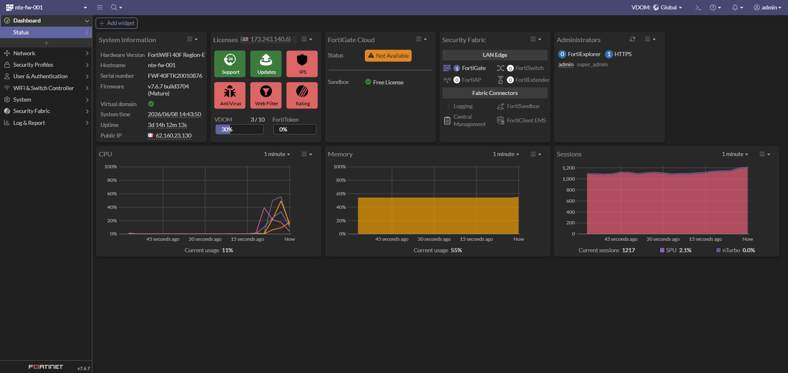
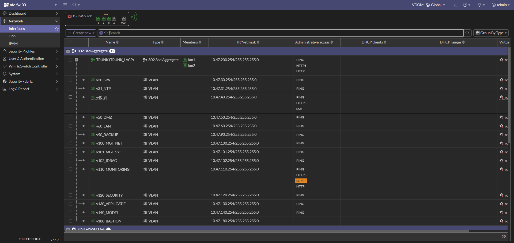
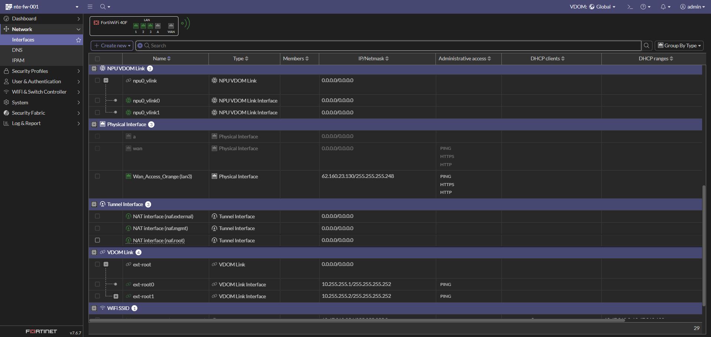
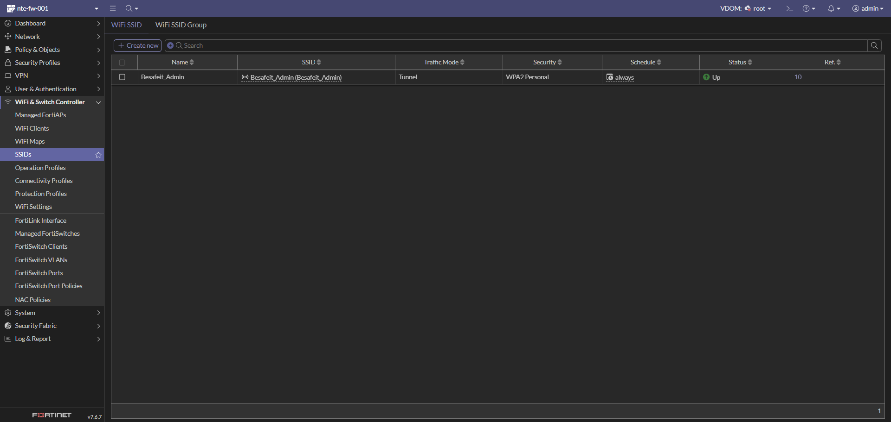
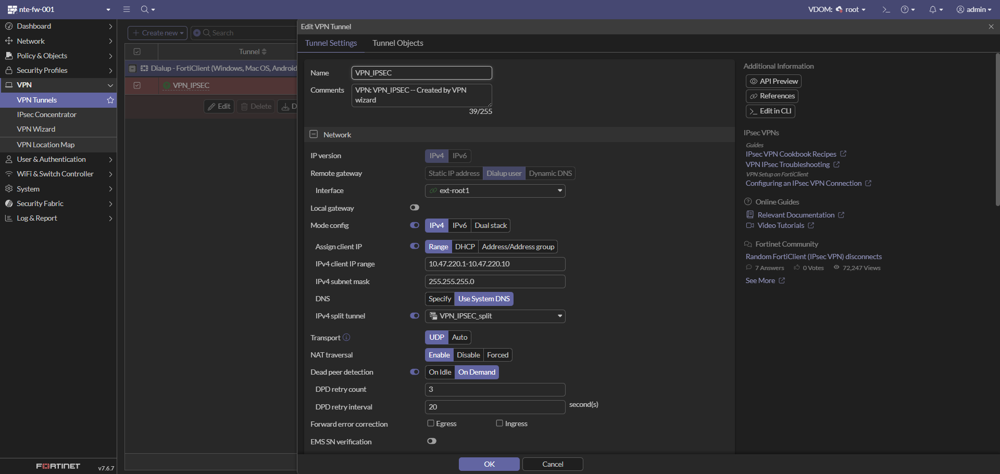
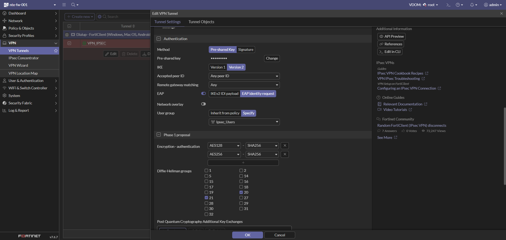
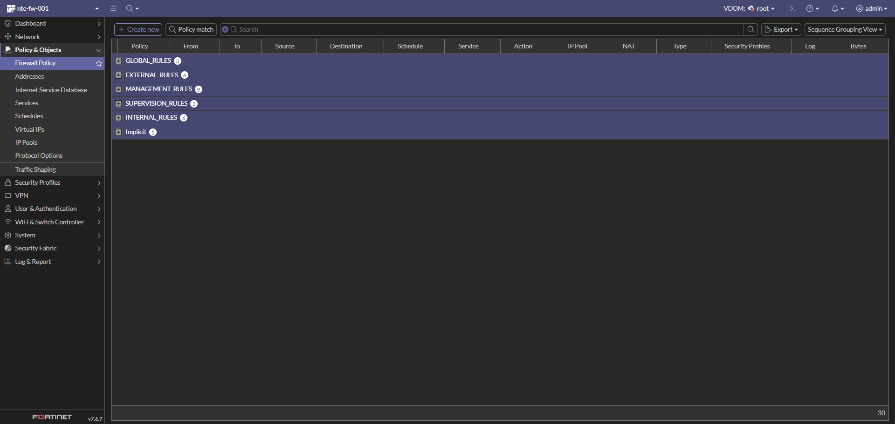
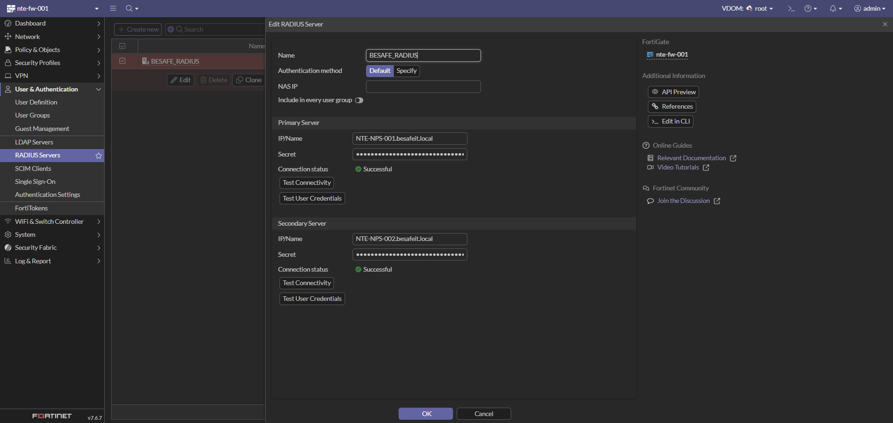

# 🛡️ Configuration du pare-feu Fortinet FortiWiFi 40F

> Cette page documente la configuration complète du **pare-feu FortiWiFi 40F** (`nte-fw-001`) utilisé dans l’infrastructure **BESAFE**.
> Il assure le **routage inter-VLAN**, le **filtrage**, le **NAT**, le **VPN** et le **point d’accès Wi-Fi d’administration**, le tout en architecture **multi-VDOM**.

---

## ⚙️ Détails techniques

| Élément | Valeur |
|:--|:--|
| **Modèle** | FortiWiFi 40F (Region-E) |
| **Hostname** | `nte-fw-001` |
| **Numéro de série** | `FWF40FTK20010876` |
| **Firmware** | v7.6.7 build3704 (Mature) |
| **Rôle** | Pare-feu, routage inter-VLAN, NAT, VPN, Wi-Fi |
| **VDOM** | Multi-VDOM activé (`Global` / `root`) — 3 / 10 |
| **IP publique (WAN)** | 62.160.23.130 |
| **Méthode d’administration** | HTTPS / SSH |

---

### 📸 Capture 1 – Tableau de bord (Status)

Vue d’ensemble de l’état du boîtier :

- **System time** : 2026/06/08 — **Uptime** : 3j 14h
- **CPU** : ~11 % · **Mémoire** : ~55 % · **Sessions** : ~1200
- **Licences** : Support / Updates actifs, FortiGate Cloud non utilisé
- **Security Fabric** : FortiGate racine, connecteurs disponibles (Logging, FortiSandbox, etc.)

---

## 🌐 Étape 1 : Configuration réseau

> Objectif : définir les interfaces physiques, l’agrégat LACP et les VLANs associés afin d’assurer le routage entre les réseaux internes et la connectivité Internet.

---

### 📸 Capture 2 – Interfaces & VLANs (agrégat LACP)

Le LAN interne repose sur un **agrégat 802.3ad (LACP)** nommé **TRUNK (TRUNK_LACP)**, composé des ports physiques **lan1** et **lan2**. Tous les VLANs internes sont tagués sur ce trunk.

| Interface | Type | Réseau / IP FW (.254) | Accès admin |
|:--|:--|:--|:--|
| **TRUNK (TRUNK_LACP)** | 802.3ad Aggregate (lan1 + lan2) | 10.47.200.254/24 | PING, HTTPS, HTTP |

**VLANs transportés par le trunk :**

| VLAN | Interface | Réseau | IP FW (.254) | Accès admin | Description |
|:--|:--|:--|:--|:--|:--|
| 30 | `v30_SRV` | 10.47.30.0/24 | 10.47.30.254 | PING | Serveurs AD / DNS / DHCP |
| 31 | `v31_NTP` | 10.47.31.0/24 | 10.47.31.254 | PING | Serveurs de temps (NTP) |
| 40 | `v40_SI` | 10.47.40.0/24 | 10.47.40.254 | PING, HTTPS, SSH | Admin / SI interne |
| 50 | `v50_DMZ` | 10.47.50.0/24 | 10.47.50.254 | PING | Réseau exposé (DMZ) |
| 60 | `v60_LAN` | 10.47.60.0/24 | 10.47.60.254 | PING | Utilisateurs internes |
| 90 | `v90_BACKUP` | 10.47.90.0/24 | 10.47.90.254 | PING | Sauvegarde (Veeam / NAS) |
| 100 | `v100_MGT_NET` | 10.47.100.0/24 | 10.47.100.254 | PING | Mgmt Switch / réseau |
| 101 | `v101_MGT_SYS` | 10.47.101.0/24 | 10.47.101.254 | PING | Mgmt ESXi / VCSA |
| 102 | `v102_IDRAC` | 10.47.102.0/24 | 10.47.102.254 | PING | Accès iDRAC serveurs |
| 110 | `v110_MONITORING` | 10.47.110.0/24 | 10.47.110.254 | PING, HTTPS, SNMP, HTTP | Supervision (Zabbix / Grafana) |
| 120 | `v120_SECURITY` | 10.47.120.0/24 | 10.47.120.254 | PING | Wazuh / IDS / SOC |
| 130 | `v130_APPLICATIF` | 10.47.130.0/24 | 10.47.130.254 | PING | GLPI / Nextcloud / Vault |
| 140 | `v140_MODEL` | 10.47.140.0/24 | 10.47.140.254 | PING | Réseau de gabarit / template |
| 180 | `v180_BASTION` | 10.47.180.0/24 | 10.47.180.254 | PING | Bastion d’administration |

> 💡 L’accès administratif (HTTPS / SSH) n’est ouvert que sur les VLANs nécessaires (`v40_SI`, `v110_MONITORING`, trunk). Le reste est limité au **PING** pour le diagnostic.

---

### 📸 Capture 3 – Interfaces WAN & liens VDOM

| Interface | Type | Réseau / IP | Accès admin | Description |
|:--|:--|:--|:--|:--|
| `wan` | Physical Interface | (DHCP) | PING, HTTPS, HTTP | Interface WAN |
| `Wan_Access_Orange (lan3)` | Physical Interface | 62.160.23.130/29 | PING, HTTPS, HTTP | Accès Internet (Orange) |
| `ext-root0` | VDOM Link Interface | 10.255.255.1/30 | PING | Lien inter-VDOM côté `root` |
| `ext-root1` | VDOM Link Interface | 10.255.255.2/30 | PING | Lien inter-VDOM (utilisé par le VPN) |
| `npu0_vlink0/1` | NPU VDOM Link | — | — | Lien matériel NPU entre VDOM |

> 🧱 L’architecture **multi-VDOM** sépare la partie « accès / WAN » (`Global`) de la partie « production » (`root`). Le trafic transite via les liens **ext-root** (10.255.255.0/30).

---

### ⚙️ Bonnes pratiques
- 🔒 Limiter l’accès administratif (HTTPS/SSH) aux seuls VLANs d’administration.
- 🧱 Créer des **objets / zones** par VLAN pour simplifier les règles (`Zone_v30_SRV`, etc.).
- 🕒 Activer la synchro **NTP** (VLAN 31) pour des logs cohérents.
- 🔁 Vérifier l’état **LACP** du trunk (lan1 + lan2) côté switch.

---

## 📶 Étape 2 : Point d’accès Wi-Fi (FortiWiFi)

> Objectif : exposer un SSID d’administration sécurisé via la radio intégrée du FortiWiFi 40F.

### 📸 Capture 4 – SSID configuré

| Paramètre | Valeur |
|:--|:--|
| **Nom / SSID** | `Besafeit_Admin` |
| **Traffic Mode** | Tunnel |
| **Sécurité** | WPA2 Personal |
| **Schedule** | always |
| **Statut** | 🟢 Up |

> 💡 Le SSID est diffusé en mode **Tunnel** : le trafic Wi-Fi est remonté jusqu’au FortiGate avant d’être filtré par la politique, ce qui permet de l’assigner à une zone (`Besafeit_Admin`) dans les règles.

---

## 🔐 Étape 3 : VPN IPSec (Client-to-Site / Dialup)

> Objectif : permettre l’accès distant sécurisé au réseau BESAFE via **FortiClient** (IPSec dialup), avec authentification sur annuaire et chiffrement moderne.

---

### 📸 Capture 5 – Paramètres réseau du tunnel

| Paramètre | Valeur |
|:--|:--|
| **Nom** | `VPN_IPSEC` |
| **Type** | Dialup user (Client-to-Site) |
| **Interface** | `ext-root1` |
| **Mode config** | Activé (IPv4) |
| **Plage IP clients** | 10.47.220.1 – 10.47.220.10 |
| **Masque** | 255.255.255.0 |
| **DNS** | Use System DNS |
| **Split tunnel** | `VPN_IPSEC_split` |
| **Transport** | UDP |
| **NAT traversal** | Enable |
| **Dead Peer Detection** | On Demand (retry 3 / 20 s) |

---

### 📸 Capture 6 – Authentification

| Paramètre | Valeur |
|:--|:--|
| **Méthode** | Pre-shared Key |
| **IKE** | Version 2 |
| **EAP** | Activé (EAP identity request) |
| **User group** | `Ipsec_Users` |
| **Accepted peer ID / Remote gateway** | Any |

---

### 📸 Capture 7 – Propositions Phase 1 / Phase 2

**Phase 1 :**
- Chiffrement / authentification : **AES128-SHA256** et **AES256-SHA256**
- Groupes Diffie-Hellman : **20** et **21**
- Key lifetime : **86400 s**

**Phase 2 (sélecteurs) :**

| Nom | Local Address | Remote Address |
|:--|:--|:--|
| `VPN_IPSEC` | 0.0.0.0/0.0.0.0 | 0.0.0.0/0.0.0.0 |

> ✅ Le tunnel **`Dialup - FortiClient`** complète la configuration pour les clients Windows / macOS / Android.

---

## 🧱 Étape 4 : Politique de filtrage (Firewall Policy)

> Objectif : organiser le filtrage par **groupes de séquence** (Sequence Grouping View) pour une lecture claire selon le rôle des flux.

### 📸 Capture 8 – Vue globale des groupes de règles

| Groupe | Nb de règles | Rôle |
|:--|:--:|:--|
| `GLOBAL_RULES` | 3 | Règles transverses (PING, AD/LDAP/DNS, NTP) |
| `EXTERNAL_RULES` | 6 | Flux sortants vers Internet (WAN) |
| `MANAGEMENT_RULES` | 9 | Administration depuis le bastion / SI |
| `SUPERVISION_RULES` | 5 | Supervision (⚠️ désactivées) |
| `INTERNAL_RULES` | 6 | Flux inter-VLAN applicatifs (⚠️ désactivées) |
| `Implicit` | 1 | Implicit Deny (refus par défaut) |

---

### 📸 Capture 9 – GLOBAL_RULES & EXTERNAL_RULES

**GLOBAL_RULES**

| ID | Nom | Source → Destination | Service | Action |
|:--|:--|:--|:--|:--|
| 30 | `GLP-ALL-ALLOW-PING` | any → any | PING | ✅ ACCEPT |
| 10 | `GLB-POL-ALL-DC-LDAP/DNS-ALLOW` | Zones internes → `Zone_v30_SRV` (`GRP_DC`) | Windows AD | ✅ ACCEPT |
| 11 | `GLB-POL-ALL-NTP-NTP-ALLOW` | Zones internes → `Zone_v31_NTP` (`VIP-NTP`) | NTP | ✅ ACCEPT |

**EXTERNAL_RULES** (vers `ext-root1` / Internet)

| ID | Nom | Service | Action |
|:--|:--|:--|:--|
| 32 | Accès Internet utilisateurs (LAN/SI/VPN) | Email Access, Web Access | ✅ ACCEPT |
| 39 | `BRAWL STARS` | ALL | ⚠️ ACCEPT (à revoir) |
| 40 | `SRV-EXT-ALLOW-INTERNET` | Web, Email, Rustdesk (TCP/UDP) | ✅ ACCEPT |
| 33 | `EXT-DMZ-ALLOW-HTTPS` → `NTE-NPM-001` | HTTPS | ✅ ACCEPT |
| 13 | `DC-EXT-ALLOW-NTP` (`GRP_DC`) | NTP | ✅ ACCEPT |
| 20 | `NTP-EXT-ALLOW-NTP` (`GRP-NTP`) | NTP | ✅ ACCEPT |

> ⚠️ La règle **`BRAWL STARS (39)`** autorise **tous les services** : à supprimer ou restreindre en production.

---

### 📸 Capture 10 – MANAGEMENT_RULES

Accès d’administration, principalement depuis le **bastion** (`Zone_v180_BASTION`), le **SI** (`Zone_v40_SI`) et la **zone VPN**, vers les comptes/objets sources `NTE-BASTION-001`, `NTE-PAWT0-001` et `VPN_IPSEC_range`.

| ID | Nom | Destination | Service |
|:--|:--|:--|:--|
| 26 | `INT-MGMT-BASTION-ALLOW-HTTPS` | `NTE-BASTION-001` | HTTPS |
| 21 | `INT-MGMT-DEB-ALLOW-SSH` | `GRP_LINUX` | Jump_SSH |
| 17 | `INT-MGMT-DC-RDP-ALLOW-RDP` | `GRP_Windows` | Jump_RDP |
| 9  | `INT-MGMT-FORTI-HTTPS-ALLOW-WEB` | `NTE-FW-001` | Port_FW |
| 7  | `INT-MGMT-IDRAC-HTTP-ALLOW-WEB` | `GRP_IDRAC` | HTTPS, VNC |
| 8  | `INT-MGMT-SW-SSH-ALLOW-SSH` | `GRP_SW` | SSH |
| 12 | `INT-MGMT-ESXI-HTTPS-ALLOW-WEB` | `GRP_ESXI` | HTTPS, PORT_VCSA, SSH |
| 14 | `INT-MGMT-NAS-RDP-ALLOW-RDP` | `NTE-NAS-001` | RDP |
| 31 | `INT-MGMT-NPM-ALLOW-WEB` | `NTE-NPM-001` | Port_NPM |

---

### 📸 Capture 11 – SUPERVISION_RULES

Flux depuis `Zone_v110_MONITORING` (source `NTE-SUP-001`) vers les équipements supervisés.

| ID | Nom | Cible | Service | État |
|:--|:--|:--|:--|:--|
| 27 | `SUP_TO_OTHER_ALLOW_SNMP` | `GRP_LINUX`, `GRP_SNMP_SUP` | SNMP | ⛔ Disabled |
| 41 | `SUP_TO_ESXi_ALLOW_HTTPS` | `GRP_ESXI` | HTTPS, Daemon_VCSA | ⛔ Disabled |
| 28 | `SUP_TO_OTHER_ALLOW_WinRM` | `GRP_Windows` | WinRM | ⛔ Disabled |
| 29 | `SUP_TO_OTHER_ALLOW_SSH` | `GRP_LINUX` | SSH | ⛔ Disabled |
| 35 | `SUP_TO_FW_ALLOW_HTTPS` | `NTE-FW-001` | Port_FW | ⛔ Disabled |

> ⚠️ L’ensemble du groupe **SUPERVISION_RULES est désactivé** : à réactiver une fois la supervision validée.

---

### 📸 Capture 12 – INTERNAL_RULES

Flux applicatifs inter-VLAN.

| ID | Nom | Flux | Service | État |
|:--|:--|:--|:--|:--|
| 24 | `SW_TO_NPS_ALLOW_RADIUS` | `Zone_v100_MGT_NET` → `Zone_v30_SRV` (`GRP_NPS`) | RADIUS | ⛔ Disabled |
| 34 | `DMZ-TO-APPLICATIF-ALLOW-HTTP` | `Zone_v50_DMZ` → `Zone_v130_APPLICATIF` | Port_Vault, Port_Wiki, Port_Cloud | ⛔ Disabled |
| 37 | `LAN-TO-APPLICATIF-ALLOW-WEB` | LAN/SI/VPN → `Zone_v130_APPLICATIF` | HTTP, HTTPS | ⛔ Disabled |
| 25 | `SRV-TO-SECURITY-ALLOW-WAZUH` | Zones → `Zone_v120_SECURITY` (`NTE-WAZUH-001`) | Port_Wazuh | ⛔ Disabled |
| 38 | `BACKUP_TO_NAS_ISCSI` | `Zone_v90_BACKUP` → `Zone_v101_MGT_SYS` (`NTE-NAS-001`) | iSCSI | ⛔ Disabled |
| 36 | `BACKUP_TO_ESXi_ALLOW_WEB_&_NFC` | `Zone_v90_BACKUP` → `Zone_v101_MGT_SYS` (`GRP_ESXI`) | HTTPS, NFC | ⛔ Disabled |
| — | `Implicit Deny (0)` | any → any | ALL | 🚫 DENY |

> 💡 Tout flux non explicitement autorisé tombe dans le **Implicit Deny** (refus par défaut).

---

## 🛂 Étape 5 : Authentification (RADIUS / NPS)

> Objectif : centraliser l’authentification (VPN, accès) sur les serveurs **NPS** de BESAFE via RADIUS, en haute disponibilité.

### 📸 Capture 13 – Serveur RADIUS

| Paramètre | Valeur | Commentaire |
|:--|:--|:--|
| **Nom** | `BESAFE_RADIUS` | Connecteur RADIUS |
| **Méthode d’auth.** | Default | — |
| **Serveur principal** | `NTE-NPS-001.besafeit.local` | 🟢 Connexion réussie |
| **Serveur secondaire** | `NTE-NPS-002.besafeit.local` | 🟢 Connexion réussie (HA) |

> 🔒 **Notes de sécurité BESAFE :**
> - Les **secrets RADIUS** ne doivent jamais apparaître en clair dans la documentation.
> - Le double serveur **NPS** assure la **haute disponibilité** de l’authentification.
> - Le groupe `Ipsec_Users` est utilisé pour autoriser l’accès **VPN** via cette authentification.

---

## ✅ Résumé global

| Étape | Élément | Description | État |
|:--|:--|:--|:--:|
| 1️⃣ | **Réseau** | Trunk LACP + VLANs + WAN (multi-VDOM) | ✅ |
| 2️⃣ | **Wi-Fi** | SSID `Besafeit_Admin` (WPA2, Tunnel) | ✅ |
| 3️⃣ | **VPN IPSec** | Dialup FortiClient, IKEv2, EAP | ✅ |
| 4️⃣ | **Filtrage** | 6 groupes de règles (certains désactivés) | ⚠️ |
| 5️⃣ | **Authentification** | RADIUS NPS (HA) | ✅ |

---

## 🔗 Liens utiles

- [Documentation Fortinet FortiGate / FortiOS](https://docs.fortinet.com/product/fortigate/7.6)
- [FortiWiFi 40F – Datasheet](https://www.fortinet.com/products/next-generation-firewall)
- [Fortinet Community](https://community.fortinet.com/)
- [Guide d’administration FortiOS 7.6](https://docs.fortinet.com/document/fortigate/7.6.0/administration-guide)
