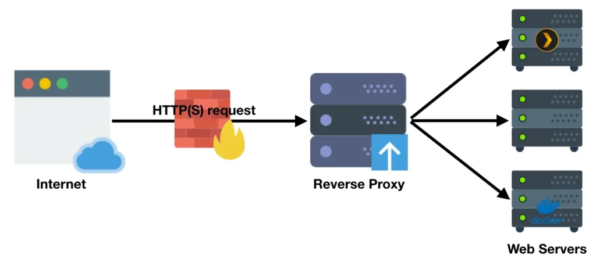
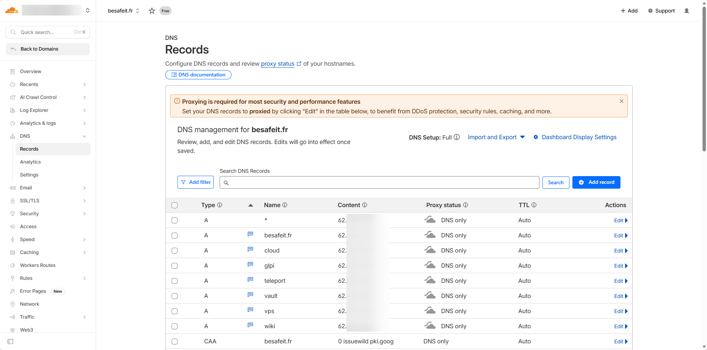
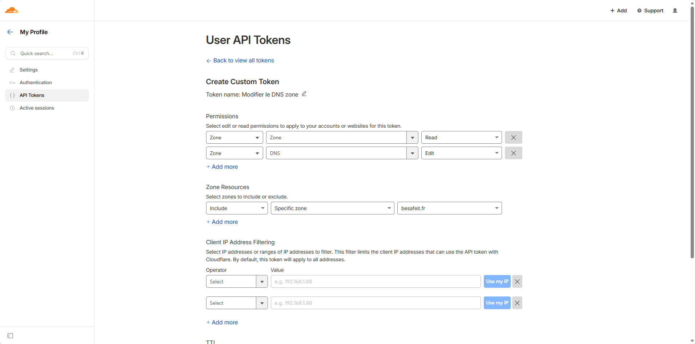
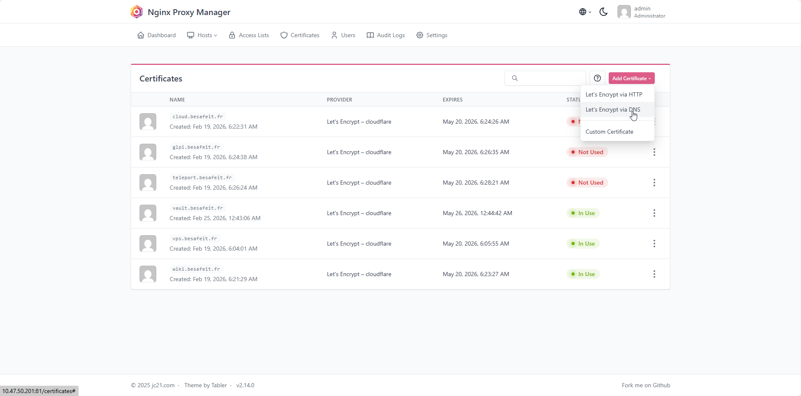
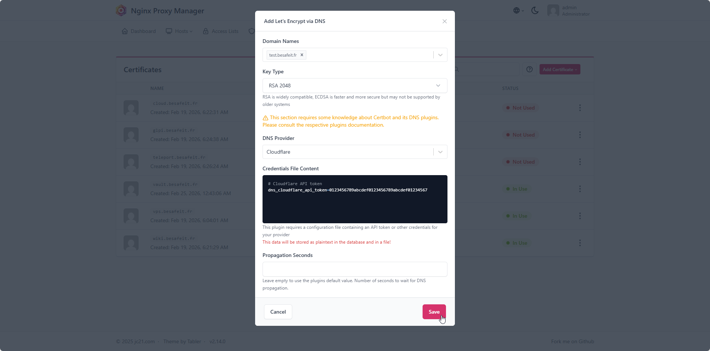

# 🔁 Nginx Proxy Manager

> Mise en place d’un **Nginx Proxy Manager **, il est le point d'entré par internet vers mes ressources interne.

---

## ⚙️ Détails techniques

| Élément | Valeur |
|:--|:--|
| **OS** | Debian 13 |
| **Rôle** | Reverse-proxy / entrée HTTP(S) unique Internet |
| **NPM** | `NTE-NPM-001` – `10.47.50.201/24` (DMZ) |
| **Ports exposés** | 80 / 443 / 81 (UI Admin) |

---

## 🌐 Étape 1 : Architecture & rôle du service

**Nginx Proxy Manager (NPM)** est utilisé dans l’infrastructure BESAFE comme **reverse proxy central**.

Son rôle est de permettre l’exposition sécurisée des services internes vers Internet.

Il agit comme une **passerelle HTTP/HTTPS** entre l’extérieur et les applications hébergées dans l’infrastructure.

---

### Principe de fonctionnement

Lorsqu’un utilisateur accède à un service via un nom de domaine :
https://wiki.besafeit.fr
  
la requête suit le chemin suivant :

  

NPM agit donc comme **point d’entrée unique pour les applications web**.

---

### Rôle du Reverse Proxy

Le reverse proxy permet plusieurs fonctions essentielles :

### Terminaison TLS

Les certificats SSL sont gérés directement par NPM :

- génération automatique via Let's Encrypt
- renouvellement automatique
- gestion centralisée des certificats

---

### Publication des services internes

Les applications internes ne sont **jamais exposées directement sur Internet**.

NPM redirige simplement les requêtes vers les services internes.

Exemple :
wiki.besafeit.fr → 10.47.130.102:3000
vault.besafeit.fr → 10.47.130.201:8080
cloud.besafeit.fr → 10.47.50.210:8080
  
---

## 🐳 Étape 2 : Déploiement Docker

Dans l’infrastructure BESAFE, **Nginx Proxy Manager est déployé via Docker Compose** sur une machine dédiée.

Le service est composé de deux conteneurs :

- **nginx proxy manager**
- **base de données MariaDB**

Cette architecture permet :

- la persistance des données
- une maintenance simplifiée
- un déploiement rapide
- une isolation des services

---

# Arborescence du service

Le service est installé dans le répertoire : /opt/npm
Structure :
/opt/npm
├── docker-compose.yml
├── data/
├── letsencrypt/
└── mysql/
  

Description des répertoires :

| Répertoire | Rôle |
|---|---|
| data | configuration NPM |
| letsencrypt | certificats SSL |
| mysql | données MariaDB |

---

# Fichier docker-compose.yml

```yaml
services:

  app:
    image: 'jc21/nginx-proxy-manager:latest'
    restart: unless-stopped

    ports:
      - "80:80"     # HTTP
      - "443:443"   # HTTPS
      - "81:81"     # Interface Admin
  
    environment:
      TZ: "Australia/Brisbane"
      DB_MYSQL_HOST: "db"
      DB_MYSQL_PORT: 3306
      DB_MYSQL_USER: "npm"
      DB_MYSQL_PASSWORD: "npm"
      DB_MYSQL_NAME: "npm"

    volumes:
      - ./data:/data
      - ./letsencrypt:/etc/letsencrypt
    depends_on:
      - db

  db:
    image: 'jc21/mariadb-aria:latest'
    restart: unless-stopped
    environment:
      MYSQL_ROOT_PASSWORD: "npm"
      MYSQL_DATABASE: "npm"
      MYSQL_USER: "npm"
      MYSQL_PASSWORD: "npm"
      MARIADB_AUTO_UPGRADE: '1'
    volumes:
      - ./mysql:/var/lib/mysql
```

### Port exposés :
  
| Port | Fonction |
|:--|:--|:--|  
| 80 | HTTP|
| 443 | HTTPS |  
| 81 | Interface d'administration |  

---

### Démarrage du service :
Dans le répertoire : /opt/npm
  
```bash
docker compose up -d  
docker ps
```   
  
---  

## 🔐 Étape 3 : Certificats Let's Encrypt via DNS Cloudflare

Dans l’infrastructure BESAFE, **Nginx Proxy Manager** gère les certificats TLS de manière centralisée via **Let’s Encrypt**.

La méthode utilisée n’est pas le challenge HTTP classique, mais un **challenge DNS** avec **Cloudflare**.

Cette approche permet :

- d’émettre des certificats sans exposer temporairement le port HTTP
- de gérer facilement plusieurs sous-domaines
- d’automatiser le renouvellement des certificats
- de s’intégrer proprement à une architecture reverse proxy

---

### Principe de fonctionnement

Le mécanisme repose sur la chaîne suivante :

```text
Nginx Proxy Manager
   │
   ▼
Cloudflare API
   │
   ▼
Création d’un enregistrement DNS temporaire (_acme-challenge)
   │
   ▼
Validation par Let’s Encrypt
   │
   ▼
Émission du certificat
```  
NPM utilise donc un token API Cloudflare pour créer automatiquement les enregistrements DNS nécessaires à la validation.

### Intégration Cloudflare

  
> Les différents sous-domaines publiés via NPM pointent vers l’IP publique de l’infrastructure

Les différents sous-domaines publiés via NPM pointent vers l’IP publique de l’infrastructure
  
### Token API Cloudflare
  

  
Un token API restreint est utilisé pour permettre à NPM de modifier uniquement la zone DNS nécessaire.

Permissions attribuées :
- Zone / Zone / Read
- Zone / DNS / Edit

Portée :
  
Specific zone → **besafeit.fr**

Cette approche est préférable à l’utilisation de la Global API Key, car elle limite fortement les privilèges donnés au service.
  
### Génération d'un Certificat dans NPM
  
  
Cette méthode présente plusieurs avantages dans BESAFE :
- pas besoin d’ouvrir temporairement un challenge HTTP spécifique
- fonctionne même pour des services non directement exposés en clair
- compatible avec plusieurs sous-domaines
- automatisation complète depuis NPM
- renouvellement transparent des certificats
  
Elle est particulièrement adaptée à une architecture où NPM joue le rôle de frontal HTTPS unique.
  

Cici, il suffit seulement de renseigner ton registar DNS, puis de remplacer dans le credential par ton token API.
  
---

## ✅ Résumé des étapes – Nginx Proxy Manager

| Étape | Objectif | Résultat attendu |
|:--|:--|:--|
| **1️⃣ Architecture NPM** | Centraliser la publication des services web | Reverse proxy unique pour l’infrastructure |
| **2️⃣ Déploiement Docker** | Héberger NPM et sa base MariaDB | Service persistent et maintenable |
| **3️⃣ Certificats Let's Encrypt** | Automatiser la gestion TLS via DNS Cloudflare | Certificats SSL valides |

---

## 🔗 Liens utiles

- [Documentation officielle Nginx Proxy Manager](https://nginxproxymanager.com/)
- [Documentation Docker Compose](https://docs.docker.com/compose/)
- [Documentation Keepalived (VRRP)](https://keepalived.readthedocs.io/en/latest/)

