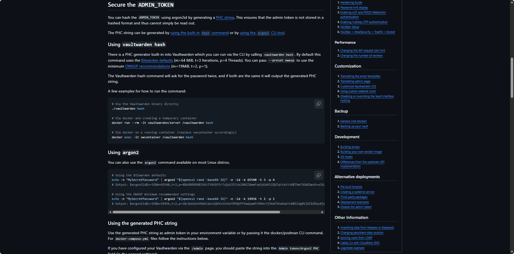
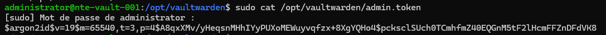
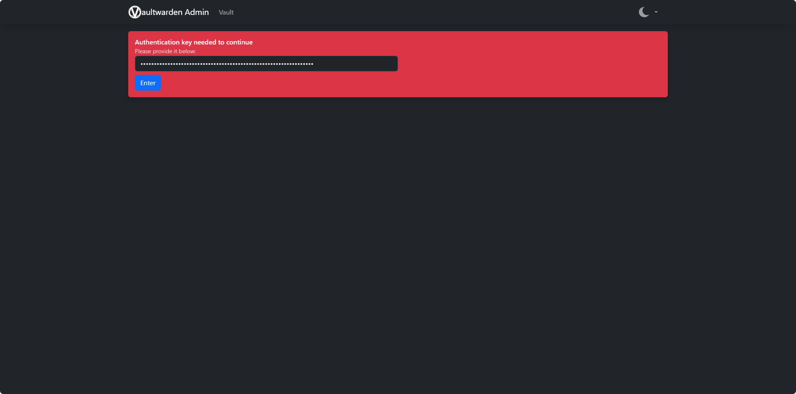
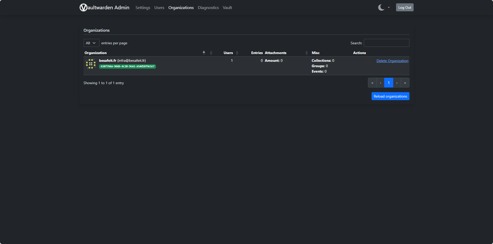
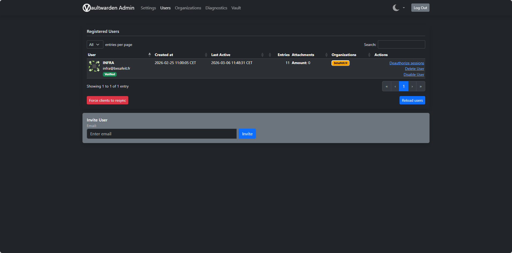
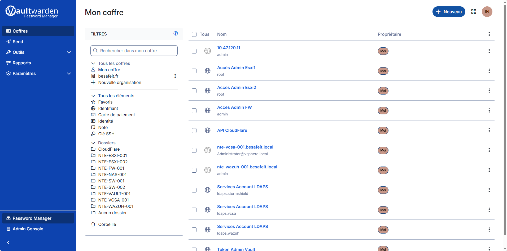

# 🔐 Mise en place de Vaultwarden

> Cette page décrit l’installation et la configuration du gestionnaire de secrets de l'entreprise **BESAFE**.

---

## ⚙️ Détails techniques

| Élément | Valeur |
|:--|:--|
| **OS** | Debian 13 |
| **Rôle** | Gestion des Secrets |
| **NPM** | `NTE-VAULT-001` – `10.47.130.101/24` (APLICATIFS) |
| **Ports exposés** | 80 / 443 |

---

### 🔐 Vaultwarden – Gestionnaire de secrets BESAFE

Vaultwarden est utilisé dans l’infrastructure **BESAFE** comme gestionnaire centralisé de secrets.

Il permet de stocker de manière sécurisée :

- identifiants administrateurs
- tokens API
- comptes de service
- accès aux équipements d’infrastructure
- clés SSH

L’objectif est de **centraliser les secrets sensibles** de l’infrastructure afin d’éviter leur stockage dans des scripts, fichiers ou documents non sécurisés.

L’accès au service se fait via : https://vault.besafeit.fr
  

Le chiffrement TLS est assuré par **Nginx Proxy Manager**.

---

### 📦 Déploiement Docker

Vaultwarden est déployé sur une VM dédiée via **Docker Compose**.

Le service n’est pas exposé directement sur Internet :  
le trafic passe par **Nginx Proxy Manager** qui gère le TLS.

```yaml
## Configuration Docker Compose

services:

  vaultwarden:
    image: vaultwarden/server:latest
    restart: unless-stopped

    environment:
      TZ: Europe/Paris
      # URL externe (servie par NPM)
      DOMAIN: "https://vault.besafeit.fr"
      # Token admin sécurisé
      ADMIN_TOKEN_FILE: /run/secrets/admin_token
      # Sécurité
      SIGNUPS_ALLOWED: "false"
      INVITATIONS_ALLOWED: "true"
      # SMTP (sera configuré lorsque Exchange sera opérationnel)
      # SMTP_HOST: "mail.besafe.local"
      # SMTP_PORT: "25"
      # SMTP_SECURITY: "off"
      # SMTP_FROM: "vaultwarden@besafe.local"

    secrets:
      - admin_token

    ports:
      - "8080:80"

    volumes:
      - vw_data:/data

volumes:
  vw_data:

secrets:
  admin_token:
    file: /opt/vaultwarden/admin.token  
```  

---  
  
### 🔑 Sécurité appliquée

Plusieurs mesures de sécurité sont appliquées :
- accès HTTPS via Nginx Proxy Manager
- stockage persistant des données
- désactivation des inscriptions publiques
- utilisation d’un ADMIN_TOKEN sécurisé
- gestion des accès via organisation
  
```bash
SIGNUPS_ALLOWED=false
INVITATIONS_ALLOWED=true
```

### 🔑 Sécurisation de l’Admin Token
L’accès à l’interface d’administration Vaultwarden nécessite un ADMIN_TOKEN.

Afin d’éviter le stockage d’un mot de passe en clair, un hash Argon2 est utilisé.

La documentation officielle recommande cette méthode.

  
```bash
echo -n "MonSuperTokenAdmin" | argon2 "$(openssl rand -base64 32)" -e -id -k 65540 -t 3 -p 4

#Résultat : 
$argon2id$v=19$m=65540,t=3,p=4$...
```
  
Le hash est stocké dans le fichier : /opt/vaultwarden/admin.token

  
  
### 🛠 Interface Admin et Organisation
L’interface d’administration est accessible via : https://vault.besafeit.fr/admin
  
  
  
Elle permet de gérer :
- utilisateurs
- organisations
- diagnostics
- configuration
  
Une organisation a été créée pour structurer les secrets : besafeit.fr
  

  
Cette organisation permettra :
- le partage sécurisé de secrets
- la gestion des accès entre administrateurs
- la centralisation des credentials d’infrastructure
  
  
Création de notre utilisateur qui est Super-Admin.
  
### 🔐 Coffre de secrets  

Vaultwarden stocke les secrets d’administration de l’infrastructure.


  
Exemples de secrets stockés :
- accès administrateur ESXi
- accès Firewall
- comptes LDAP
- accès vCenter
- accès Wazuh
- token API Cloudflare

Les secrets sont organisés par dossiers correspondant aux équipements d’infrastructure.

Cela permet :
- une meilleure organisation
- une gestion simplifiée des accès
- une traçabilité des credentials utilisés.
  
---

## ✅ Résumé des étapes

| Étape | Objectif | Résultat attendu |
| :--- | :--- | :--- |
| **1️⃣ Présentation du service** | Expliquer le rôle de Vaultwarden dans l’infrastructure BESAFE | Compréhension du rôle de gestionnaire de secrets |
| **2️⃣ Déploiement Docker** | Déployer Vaultwarden via Docker Compose avec stockage persistant | Service opérationnel et accessible via NPM |
| **3️⃣ Sécurisation Admin Token** | Générer et stocker un token admin sécurisé avec Argon2 | Accès admin protégé et token non stocké en clair |
| **4️⃣ Interface Admin & Organisation** | Configurer l’organisation BESAFE et les utilisateurs | Gestion centralisée des accès aux secrets |
| **5️⃣ Coffre de secrets** | Stocker et organiser les identifiants d’infrastructure | Centralisation sécurisée des credentials |


---

## 🔗 Liens utiles

- [Guide Vaultwarden](https://github.com/dani-garcia/vaultwarden)
- [Secure ADMIN TOKEN](https://github.com/dani-garcia/vaultwarden/wiki/Enabling-admin-page#secure-the-admin_token)
