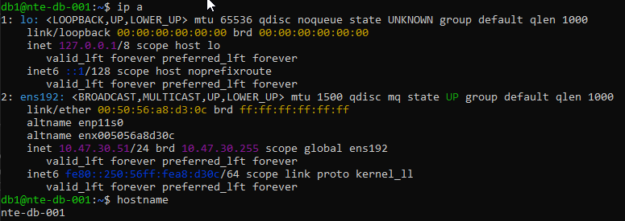
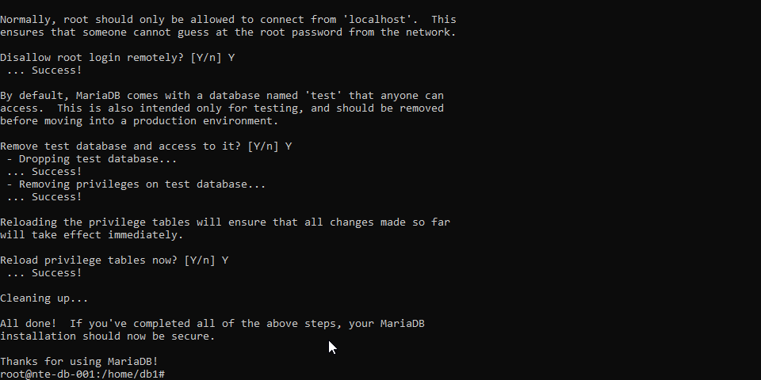
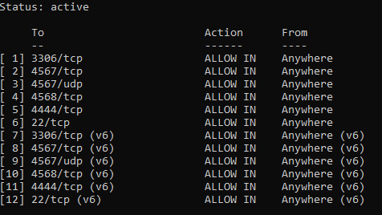
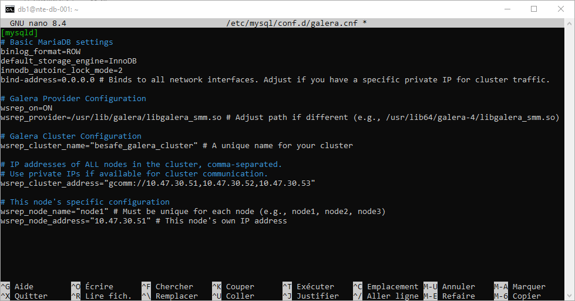
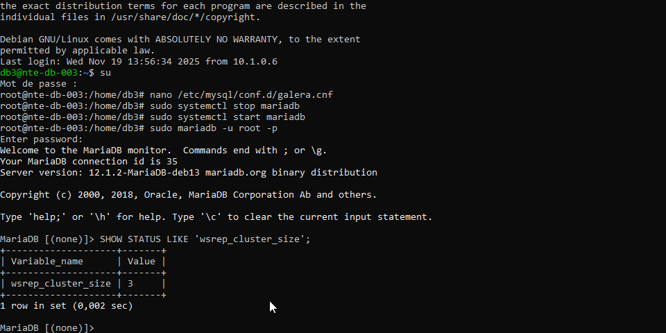

# 🗄️ Cluster MariaDB Galera – Projet BESAFE

> Cette page décrit l’installation, la configuration et la validation d’un **cluster MariaDB Galera 3 nœuds** pour le projet **BESAFE**.  
> Objectif : obtenir une base de données **hautement disponible**, **multi-master** (lecture/écriture sur tous les nœuds) avec **réplication synchrone**.

---

## ⚙️ Détails techniques

| Élément | Valeur |
|:--|:--|
| **Type de cluster** | MariaDB Galera Cluster |
| **Nombre de nœuds** | 3 |
| **Système d’exploitation** | Debian 12 (x64) |
| **Version MariaDB** | 10.11.x (ou 10.6.x LTS) |
| **Fournisseur Galera** | galera-4 |
| **Mode** | Multi-primary (multi-master) |
| **Réplication** | Synchrone WSREP |
| **Réseau** | VLAN SRV `10.47.30.0/24` |
| **Ports utilisés** | `3306/tcp`, `4567/tcp+udp`, `4568/tcp`, `4444/tcp` |

### 🌐 IP des nœuds BESAFE

| Nœud | Nom | Adresse IP |
|:--|:--|:--|
| Node 1 | `db1` | `10.47.30.51` |
| Node 2 | `db2` | `10.47.30.52` |
| Node 3 | `db3` | `10.47.30.53` |

---

<details>
<summary>🚀 Étape 1 : Pré-requis et préparation des nœuds</summary>

### ✅ Conditions nécessaires

- 3 serveurs Debian 12
- Configuration réseau `VLAN 30`
- Accès `root` ou `sudo` sur chaque nœud
- Résolution DNS ou `/etc/hosts` opérationnelle entre les nœuds
- Latence faible (idéalement même VLAN SRV)
- Synchronisation horaire **NTP obligatoire**
- `rsync` installé (utilisé pour les SST)

---

### 📦 Installation de rsync

```bash  
sudo apt install rsync -y
```

### 📸 Capture – Préparation système



</details> 

<details>
<summary>📥 Étape 2 : Installation de MariaDB + Galera</summary>

### 2.1 Ajout du dépôt MariaDB (officiel)

```bash
sudo apt update
sudo apt install dirmngr apt-transport-https ca-certificates curl -y

curl -LsS https://r.mariadb.com/downloads/mariadb_repo_setup | sudo bash

sudo apt update
```

### 2.2 Installation des paquets MariaDB + Galera
```bash
sudo apt install mariadb-server mariadb-client galera-4 -y
```
</details>

<details>
<summary>🔐 Étape 3 : Sécurisation initiale de MariaDB</summary>

### 3.1 Lancer le script de sécurisation

À exécuter sur **chaque nœud** :

```bash
sudo mariadb-secure-installation
```

### 3.2 Réponses recommandées

>Définir un mot de passe root fort

>Remove anonymous users → Y

>Disallow root login remotely → Y

>Remove test database → Y

>Reload privilege tables → Y
  
### 📸 Capture – Script de sécurisation


</details>

<details>
<summary>🧱 Étape 4 : Ouverture des ports Firewall</summary>

### 4.1 Ports nécessaires pour Galera

| Port | Protocole | Usage |
|------|-----------|-------|
| **3306** | TCP | Connexions clients MariaDB |
| **4567** | TCP/UDP | Réplication Galera (trafic principal) |
| **4568** | TCP | IST (Incremental State Transfer) |
| **4444** | TCP | SST (State Snapshot Transfer) |
| **22** | TCP | SSH (administration) |

---

### 4.2 Configuration UFW (sur chaque nœud)

```bash
sudo ufw allow 22/tcp
sudo ufw allow 3306/tcp
sudo ufw allow 4567/tcp
sudo ufw allow 4567/udp
sudo ufw allow 4568/tcp
sudo ufw allow 4444/tcp

sudo ufw reload
sudo ufw enable
```
  
### 📸 Capture – Règles Firewall configurées


</details>  

<details>
<summary>⚙️ Étape 5 : Configuration du cluster Galera (galera.cnf)</summary>

### 5.1 Fichier de configuration Galera

Le fichier utilisé :
`/etc/mysql/conf.d/galera.cnf`


Le contenu est identique sur les 3 nœuds, **sauf** pour :
- `wsrep_node_name`
- `wsrep_node_address`

---

### 5.2 Modèle commun (à placer sur chaque nœud)

```ini
[mysqld]
# Basic MariaDB settings
binlog_format=ROW
default_storage_engine=InnoDB
innodb_autoinc_lock_mode=2
bind-address=0.0.0.0 # Binds to all network interfaces. Adjust if you have a specific private IP for cluster traffic.

# Galera Provider Configuration
wsrep_on=ON
wsrep_provider=/usr/lib/galera/libgalera_smm.so # Adjust path if different (e.g., /usr/lib64/galera-4/libgalera_smm.so)

# Galera Cluster Configuration
wsrep_cluster_name="my_galera_cluster" # A unique name for your cluster

# IP addresses of ALL nodes in the cluster, comma-separated.
# Use private IPs if available for cluster communication.
wsrep_cluster_address="gcomm://node1_ip_address,node2_ip_address,node3_ip_address"

# This node's specific configuration
wsrep_node_name="node1" # Must be unique for each node (e.g., node1, node2, node3)
wsrep_node_address="node1_ip_address" # This node's own IP address
```

### 📸 Capture – Édition de galera.cnf


</details>

<details>
<summary>🏁 Étape 6 : Bootstrapping du cluster</summary>

### 6.1 Arrêt de MariaDB sur les trois nœuds

Avant l'initialisation, arrêter MariaDB sur **db1**, **db2**, **db3** :

```bash
sudo systemctl stop mariadb
```

### 6.2 Bootstrapping du premier nœud (db1 UNIQUEMENT)

Cette commande crée le cluster et doit être lancée une seule fois :  
```bash
sudo galera_new_cluster
```
  
### 6.3 Démarrer les deux autres nœuds (db2 & db3)
```bash
sudo systemctl start mariadb
  ```
</details>  

<details>
<summary>🔍 Étape 7 : Vérification de l’état du cluster</summary>

### 7.1 Connexion à MariaDB

Sur n’importe quel nœud :

```sqlbash
sudo mariadb -u root -p
```  

### 7.2 Vérifier la taille du cluster
```sql
SHOW STATUS LIKE 'wsrep_cluster_size';
```  

Résultat attendu :
```sql
+--------------------+-------+
| wsrep_cluster_size | 3     |
+--------------------+-------+
```  

### 7.3 Vérifications complémentaires
```sql
SHOW STATUS LIKE 'wsrep_cluster_status';
SHOW STATUS LIKE 'wsrep_ready';
SHOW STATUS LIKE 'wsrep_connected';
```
  
Valeurs attendues :
```sql  
wsrep_cluster_status → Primary

wsrep_ready → ON

wsrep_connected → ON
```
  

### 📸 Capture – Vérification WSREP
  

</details>  

<details>
<summary>🛡️ Étape 8 : Bonnes pratiques, supervision & maintenance</summary>

### 🔐 Sécurité

- Restreindre l’accès au port **3306** aux seules IP applicatives autorisées.
- Ne **jamais** utiliser le compte `root` pour une application.
- Créer des **comptes applicatifs dédiés** avec les privilèges minimum.
- Mettre en place une **rotation régulière** des mots de passe.
- Désactiver l'accès root distant si non nécessaire.

---

### 💾 Sauvegardes

- Ne pas exécuter `mysqldump` simultanément sur plusieurs nœuds.
- Désigner un **nœud dédié aux sauvegardes**.
- Préférer les outils compatibles Galera (ex. **MariaBackup**) pour des sauvegardes cohérentes.
- Vérifier régulièrement les **restaurations** (procédures PRA).

---

### 📈 Supervision

Suivre en monitoring (Centreon, Zabbix, Wazuh...) :

- `wsrep_cluster_size`  
- `wsrep_cluster_status`  
- `wsrep_ready`  
- `wsrep_connected`  
- Charge CPU / RAM  
- Latence disque  
- Espace disque (`/var/lib/mysql`)  

---

### 🧰 Commandes utiles

```bash
# État du service
sudo systemctl status mariadb

# Logs temps réel
sudo journalctl -u mariadb -f

# Variables WSREP
sudo mariadb -u root -p -e "SHOW STATUS LIKE 'wsrep%';"
```  
</details>
  
## ✅ Résumé des étapes

| Étape | Objectif | Résultat attendu | Statut |
|:--|:--|:--|:--|
| 1️⃣ Pré-requis | Préparer les nœuds (NTP, rsync, réseau) | Nœuds prêts et synchronisés | 🟢|
| 2️⃣ Installation | Installer MariaDB + Galera | Services installés sur 3 nœuds | 🟢|
| 3️⃣ Sécurisation | Exécuter `mariadb-secure-installation` | MariaDB sécurisé | 🟢|
| 4️⃣ Firewall | Ouvrir les ports requis | 3306 / 4567 / 4568 / 4444 accessibles | 🟢|
| 5️⃣ Configuration | Créer `galera.cnf` + paramètres nœud | Config validée sur 3 nœuds | 🟢|
| 6️⃣ Bootstrapping | Initialiser db1 puis démarrer db2/db3 | Cluster démarré | 🟢|
| 7️⃣ Vérification | Vérification de l’état du cluster | Cluster stable et Primary | 🟢|
| 8️⃣ Bonnes pratiques | Sécurité, supervision, backups | Points clés en place | 🟢|

---

## 🔗 Liens & Références

- Documentation Galera : https://mariadb.com/kb/en/galera-cluster/
- Quickstart MariaDB Galera : https://mariadb.com/docs/galera-cluster/galera-cluster-quickstart-guides/
- Documentation MariaDB : https://mariadb.com/docs/server/
  
