# 🔐 Infrastructure PKI – Projet BESAFE

> Cette page présente l’architecture de la **PKI interne BESAFE**, son rôle, les composants déployés et les bonnes pratiques suivies.  

---

## ⚙️ Détails techniques

La PKI constitue la **racine de confiance** du système d’information BESAFE.  
Elle garantit :

| Domaine | Usage | Exemples |
|:--|:--|:--|
| **Infrastructure** | Sécurisation des consoles et services | ESXi, vCenter, Stormshield, Switchs |
| **Active Directory** | LDAPS, authentification forte | Contrôleurs de domaine, serveurs membres |
| **Applications internes** | HTTPS interne, API | GLPI, Nextcloud, Vaultwarden, Wiki.js |
| **Accès distant** | VPN SSL & IPSec (certificats serveur) | fw01.besafe.local |
| **Sécurité** | Signature / chiffrement | Wazuh, journaux signés |

---

🏗️ Étape 1 : Architecture PKI BESAFE

  
### Architecture PKI BESAFE

> L’infrastructure PKI de BESAFE suit un modèle **à deux niveaux (2-Tier)** :  
> • Une **autorité racine hors-ligne (RootCA)** totalement isolée  
> • Deux **autorités intermédiaires SubCA** dédiées aux besoins serveurs & équipements  
> Ce design garantit un haut niveau de sécurité tout en permettant une exploitation quotidienne simple.

### 📸 Schéma PKI 2-Tier
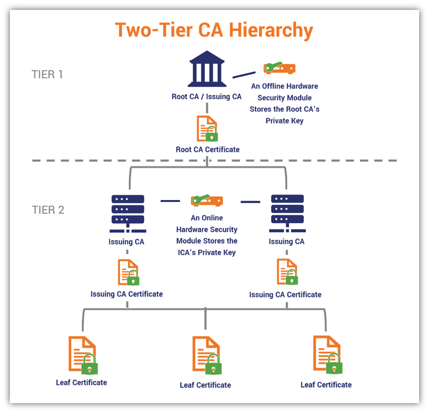

---

### 🔐 Composants de la PKI

| Rôle | Nom | OS / Type | État | Description |
|:--|:--|:--|:--|:--|
| **Autorité racine (Tier 0)** | **NTE-ROOTCA-001** | Windows Server Core | **Offline** | Autorité suprême. Ne signe que les SubCAs. Jamais en ligne. |
| **Autorité intermédiaire – Serveurs (Tier 1/2)** | **NTE-SUBCA-001** | Windows Server | **Online** | Délivre les certificats serveur (HTTPS, LDAPS, appliances, ESXi…). |
| **Autorité intermédiaire – Applicatifs (Tier 1/2)** | **NTE-SUBCA-002** | Windows Server | **Online** | Délivre les certificats applicatifs (NPM, Nextcloud, Vaultwarden…). |
| **Répondeur OCSP / AIA** | *(Optionnel futur)* | Windows Server | Online | Publication des listes de révocation & endpoint OCSP. |

---

### 🌳 Vue d’ensemble de la hiérarchie

Le modèle 2-Tier apporte :

- **RootCA protégée** → niveau T0, jamais jointe au domaine, stockage offline  
- **SubCAs en ligne** → délivrent les certificats au quotidien  
- **Séparation usage serveur / applicatif**  
- **Revocation lists (CRL)** publiées automatiquement  
- **Compatibilité avec l’écosystème Windows, ESXi, Stormshield, Linux**

---

### 🖼️ Schéma PKI – BESAFE 
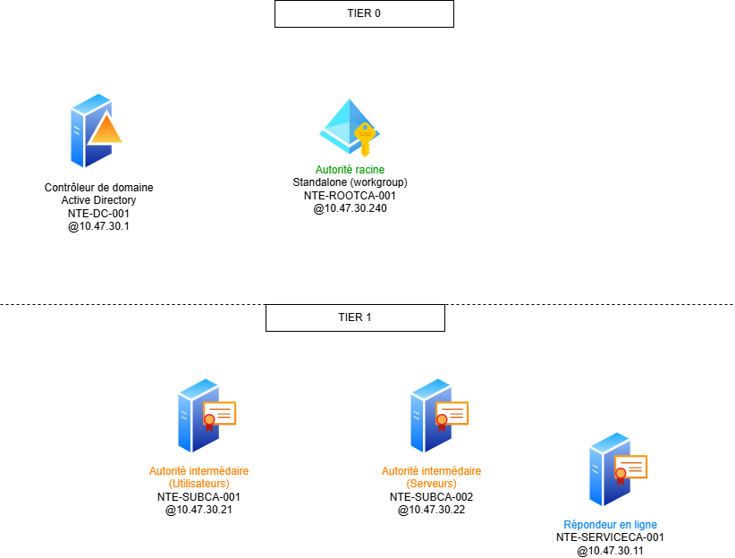
  

---

🔗 Étape 2 : Intégration avec Active Directory & Modèle de Tiering

> La PKI BESAFE applique strictement le modèle **Microsoft Enterprise PKI + Tiering AD**.  
> L’objectif : garantir une **séparation totale des privilèges**, une **émission contrôlée des certificats** et une **surface d’attaque minimale**.

---

### 🧩 1. Positionnement des rôles PKI dans le Tiering

### 🛑 **Tier 0 – Racine de confiance**
| Composant | Tier | Pourquoi |
|:--|:--|:--|
| **RootCA (offline)** | **T0** | Élément le plus critique. Compromission = PKI entière compromise. |

👉 Jamais jointe au domaine, jamais en ligne, jamais utilisée en production.  
Seulement pour :  
- signer les **SubCAs**,  
- publier les **CRL/AIA**,  
- renouveler sa propre clé (rare).

---

### 🔐 **Tier 1/2 – SubCA en production**
| Composant | Tier | Pourquoi |
|:--|:--|:--|
| **SubCA Serveurs (NTE-SUBCA-001)** | **T12** | Émet les certificats systèmes (ESXi, FW, AD…). |
| **SubCA Applicatifs (NTE-SUBCA-002)** | **T12** | Émet les certificats applicatifs (GLPI, NPM, Vault…). |

➡️ Les SubCAs **sont jointes au domaine** pour :  
- publier automatiquement dans AD les **CRL**,  
- distribuer les **AIA**,  
- gérer les modèles de certificats (Certificate Templates).

---

### 🧩 2. Intégration PKI ↔ Active Directory

### 📌 Les SubCAs sont intégrées à AD
Cela permet automatiquement :

- Publication des **CRL** dans `CN=CDP,CN=Public Key Services,CN=Services,CN=Configuration,DC=besafe,DC=local`
- Publication des **AIA** dans `CN=AIA, ...`
- Distribution automatique via **GPO → Autorités de certification approuvées**
- Inscription automatique des modèles de certificats dans **Certificate Templates**
- Validation transparente des certificats pour les machines du domaine

---

### 🧩 3. Autorités approuvées & GPO

### 🔒 GPO appliquées (automatique via AD DS)
| Objet | Rôle |
|:--|:--|
| **Trusted Root Certification Authorities** | Ajoute la RootCA BESAFE | 
| **Intermediate Certification Authorities** | Ajoute SUBCA-001 & SUBCA-002 |
| **Client Auto-Enrollment** | Les machines de domaine génèrent automatiquement leurs certificats |

➡️ Les serveurs, ESXi, appliances réseau utilisent **SUBCA-001**.  
➡️ Les applications web (Nextcloud, NPM, Vaultwarden…) utilisent **SUBCA-002**.

---

 📄 Étape 3 : Demande, installation et export d’un certificat serveur (PFX)

> Cette étape décrit comment créer un **certificat Web Server** signé par la PKI interne.
> L’objectif est d’assurer une authentification TLS fiable basée sur la PKI BESAFE.

---

### 🔹 4.1. Ouverture du magasin de certificats « Ordinateur local »

Le certificat doit être installé dans le **magasin de l’ordinateur**, et non dans le profil utilisateur.

### 📸 Capture – Lancement de la console `certlm.msc`
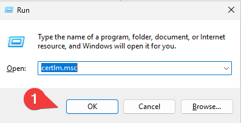

---

### 🔹 4.2. Demande d’un certificat Web Server auprès de la SubCA

L’enrôlement se fait via **l’autorité d’inscription Active Directory**.  
Le modèle utilisé est **Web Server**, modifié précédemment dans la configuration PKI (SAN obligatoire).

### 📸 Capture – Ouverture du magasin Personnel
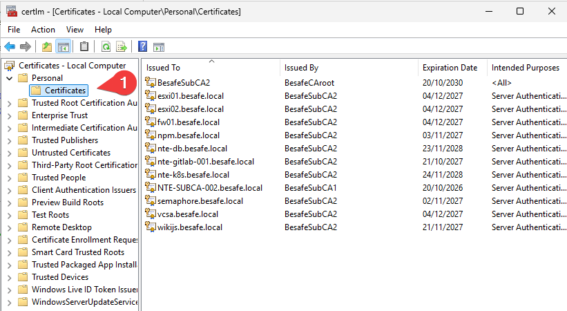

### 📸 Capture – Démarrer l’assistant d’inscription
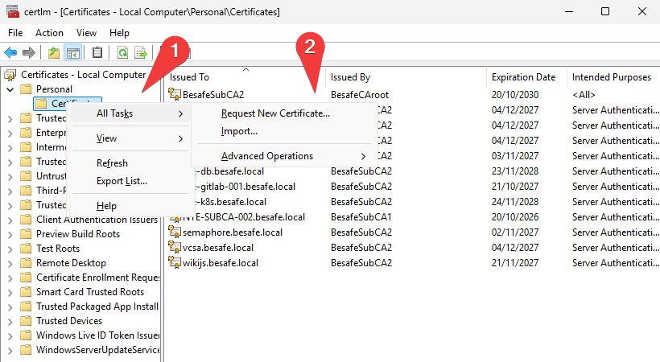

### 📸 Capture – Écran “Before you begin”
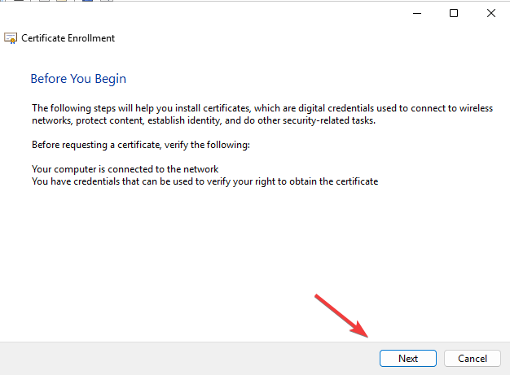

### 📸 Capture – Choix de la stratégie d’inscription
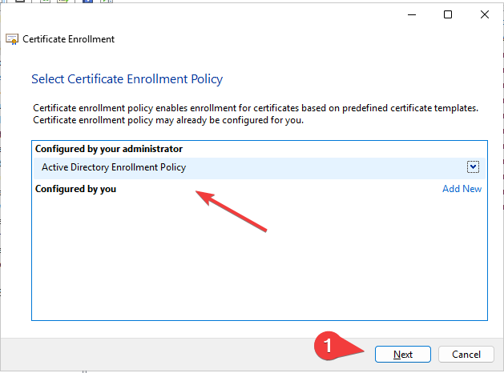

Ici, on utilise **l’inscription basée sur Active Directory** → la SubCA valide automatiquement le certificat.

### 📸 Capture – Sélection du modèle « Web Server »
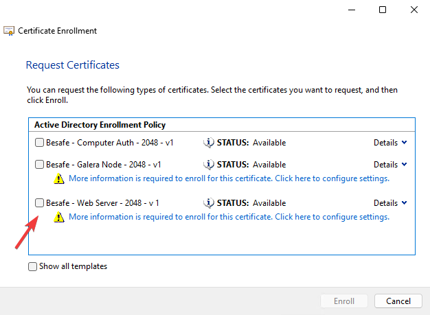

---

### 🔹 4.3. Définir le CN et les SAN du certificat

Un certificat serveur doit contenir :

- **CN (Common Name)** = Nom principal du service (ex : `npm.besafe.local`)  
- **SAN (Subject Alternative Name)** obligatoire  
  - FQDN principal  
  - Alias internes  
  - Nom DNS du service  

### 📸 Capture – Propriétés avant configuration
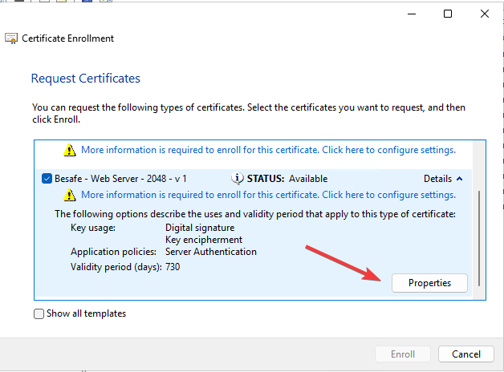

### 📸 Capture – Ajout du CN + SAN
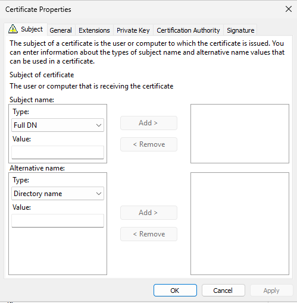

### 📸 Capture – Validation des propriétés
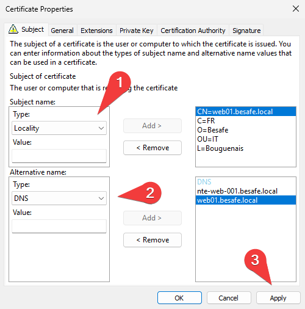

---

### 🔹 4.4. Enrôlement et installation du certificat

### 📸 Capture – Lancer l’enrôlement
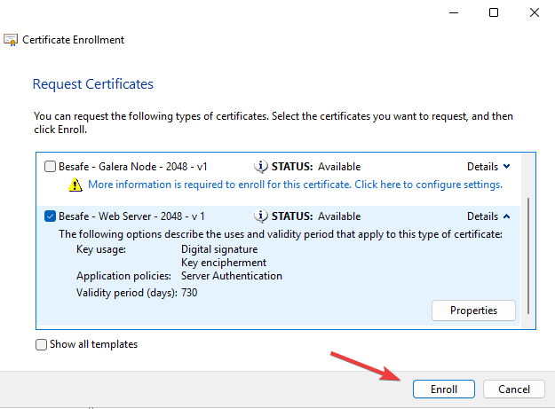

### 📸 Capture – Certificat obtenu
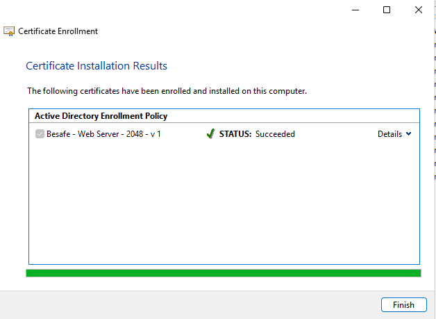

Le certificat apparaît maintenant dans **Ordinateur local → Personnel → Certificats**.

### 📸 Capture – Vue dans le magasin local
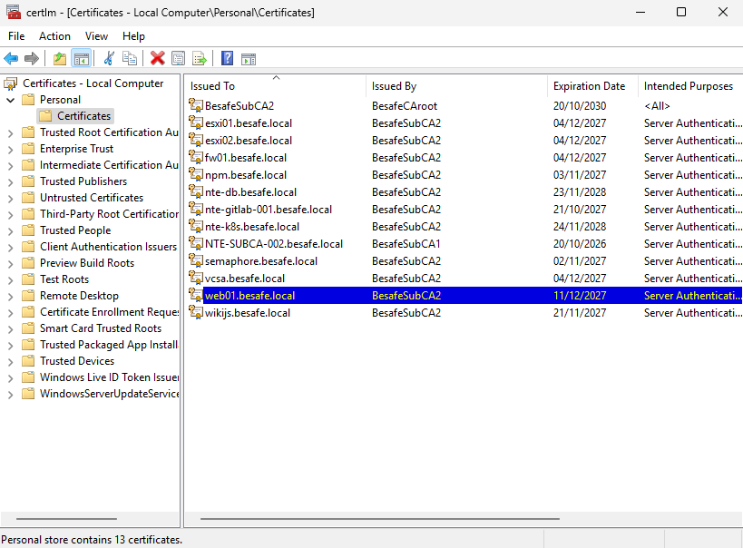

---

### 🔹 4.5. Export du certificat au format PFX (clé privée incluse)

### 📸 Capture – Démarrer l’export
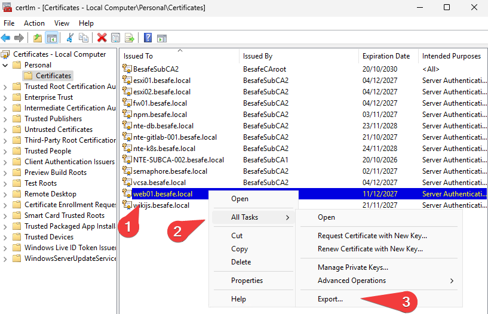

### 📸 Capture – Inclure la clé privée
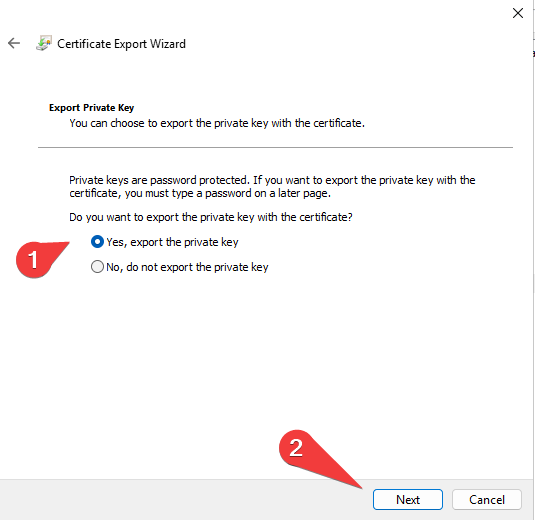

👉 Sélection obligatoire pour obtenir un fichier **PFX**.

### 📸 Capture – Sélection du format PFX
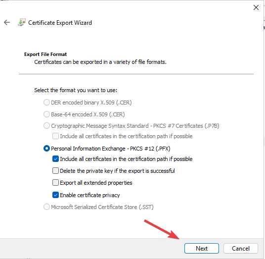

### 📸 Capture – Protection du fichier
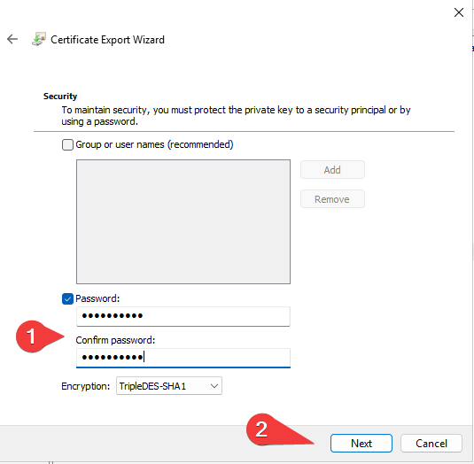

> Le mot de passe protège la clé privée dans le PFX.  
> Sans mot de passe → rejeté par la plupart des équipements.

### 📸 Capture – Sélection du chemin d’export
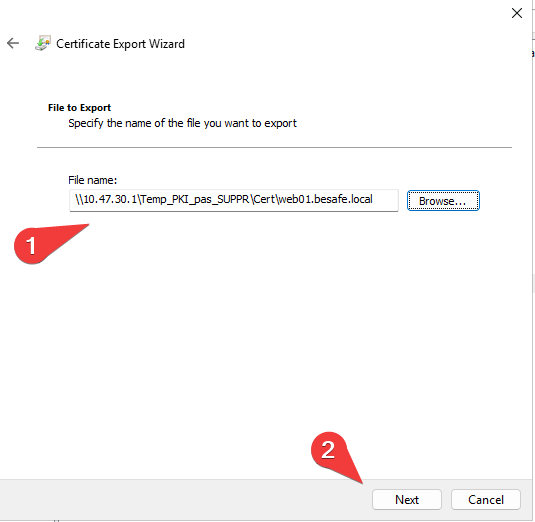

## 🧩 Résumé des étapes

| Étape                            | Objectif                                                 | Résultat attendu                         |
| :------------------------------- | :------------------------------------------------------- | :--------------------------------------- |
| **1️⃣ Architecture PKI BESAFE**  | Définir la structure RootCA / SubCA                      | Modèle PKI 2-tiers opérationnel          |
| **2️⃣ Intégration AD & Tiering** | Structurer les rôles PKI selon T0/T12                    | Séparation claire des privilèges         |
| **3️⃣ Certificat serveur (PFX)** | Génération d’un certificat complet (clé privée + chaîne) | Certificat .PFX prêt pour import serveur |

---

## 🔗 Liens utiles

[Documentation officielle Microsoft AD CS](https://learn.microsoft.com/en-us/windows-server/identity/ad-cs/)

[Cours IT-Connect (PKI Windows Server)](https://www.it-connect.fr/modules/ad-cs-deploiement-sous-windows-server/)

[RFC 5280 — X.509 Public Key Infrastructure](https://datatracker.ietf.org/doc/html/rfc5280)
