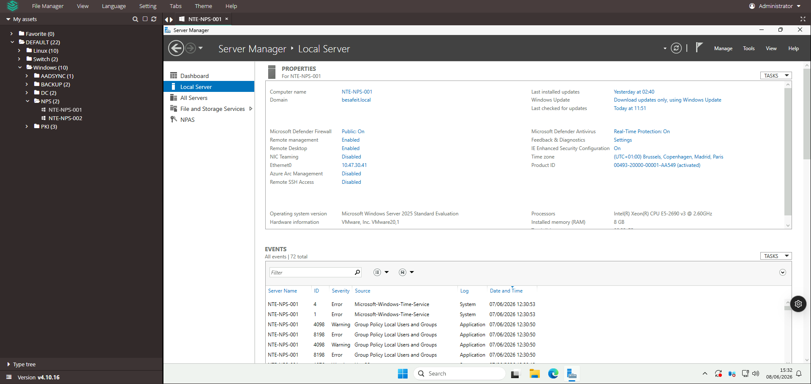
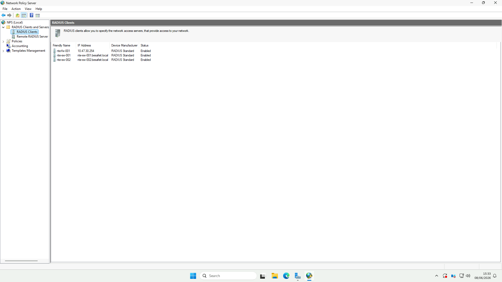
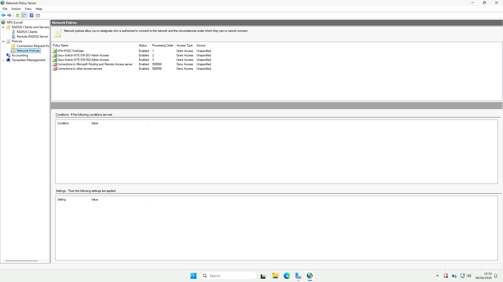
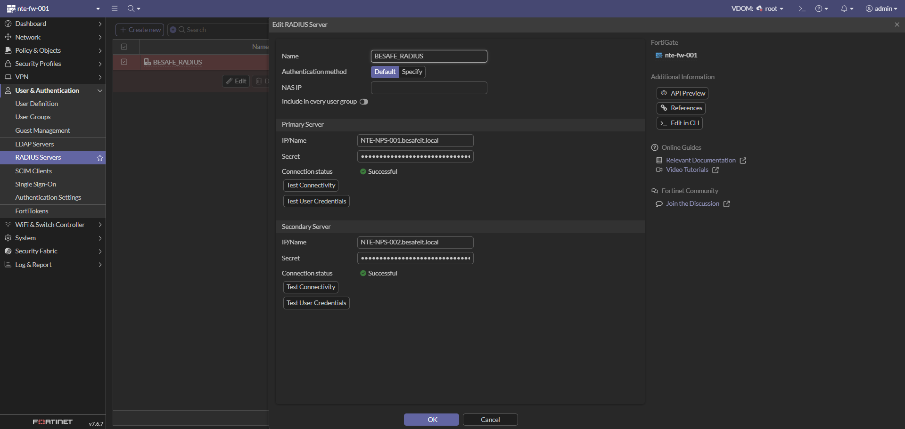
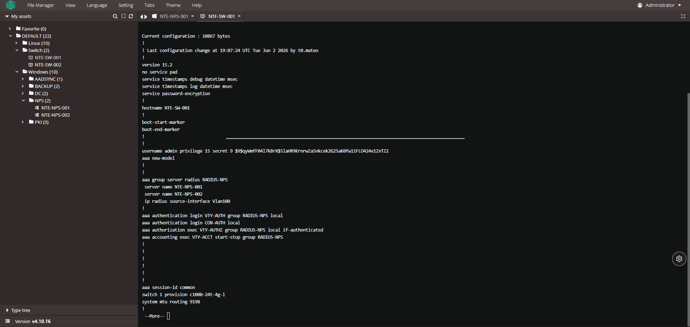

# 🔑 Authentification centralisée RADIUS (Microsoft NPS)

> Cette page documente le service **RADIUS** de l’infrastructure **BESAFE**, reposant sur **Microsoft NPS** (Network Policy Server).
> Il centralise l’authentification de l’**accès VPN** (FortiGate) et de l’**administration des switches** (Cisco), avec les comptes **Active Directory** `besafeit.local`.

---

## ⚙️ Détails techniques

| Élément | Valeur |
|:--|:--|
| **Rôle Windows** | NPAS – Network Policy and Access Services (NPS) |
| **Serveur principal** | `NTE-NPS-001` (10.47.30.41 – VLAN 30 SRV) |
| **Serveur secondaire** | `NTE-NPS-002` (haute disponibilité) |
| **OS** | Microsoft Windows Server 2025 Standard |
| **Domaine** | `besafeit.local` |
| **Protocole** | RADIUS (UDP 1812/1813) |
| **Clients RADIUS** | FortiGate `nte-fw-001`, switches `nte-sw-001` / `nte-sw-002` |

> 🔗 Voir aussi la page [Pare-feu FortiWiFi 40F](./forti-nte-fw-001.md) (Étape 5) pour le côté consommateur du VPN.

---

## 🖥️ Étape 1 : Serveurs NPS

> Objectif : héberger le rôle **NPS** sur deux serveurs membres du domaine pour assurer la **haute disponibilité** de l’authentification.

### 📸 Capture 1 – Serveur `NTE-NPS-001`


| Paramètre | Valeur |
|:--|:--|
| **Nom** | `NTE-NPS-001` |
| **Domaine** | `besafeit.local` |
| **Adresse IP** | 10.47.30.41 (VLAN 30 – SRV) |
| **OS** | Windows Server 2025 Standard |
| **Rôle** | NPAS (NPS) |
| **Processeur / RAM** | Intel Xeon E5-2690 v3 / 8 Go |
| **Time zone** | UTC+01:00 (Bruxelles, Paris…) |
| **Defender Firewall / AV** | On / Real-Time Protection On |

> 🔒 Les serveurs `NTE-NPS-001` et `NTE-NPS-002` sont **membres du domaine** `besafeit.local`, ce qui permet à NPS d’authentifier directement les comptes et groupes **Active Directory**.
> ⚠️ Quelques événements **Group Policy / Time-Service** sont présents dans le journal — à surveiller (synchro NTP / GPO).

---

## 🛰️ Étape 2 : Clients RADIUS

> Objectif : déclarer dans NPS les équipements autorisés à envoyer des requêtes d’authentification (NAS).

### 📸 Capture 2 – RADIUS Clients


| Friendly Name | Adresse | Fabricant | Statut |
|:--|:--|:--|:--|
| `nte-fw-001` | 10.47.30.254 | RADIUS Standard | 🟢 Enabled |
| `nte-sw-001` | `nte-sw-001.besafeit.local` | RADIUS Standard | 🟢 Enabled |
| `nte-sw-002` | `nte-sw-002.besafeit.local` | RADIUS Standard | 🟢 Enabled |

> 💡 Chaque client RADIUS partage un **secret** avec le NPS (non affiché ici, à ne **jamais** documenter en clair).
> ℹ️ Le pare-feu est déclaré via son IP sur le VLAN 30 (`10.47.30.254`), les switches via leur **nom DNS**.

---

## 📜 Étape 3 : Stratégies réseau (Network Policies)

> Objectif : définir **qui** est autorisé à se connecter et **dans quelles conditions**. Les stratégies sont évaluées par **ordre de traitement** croissant.

### 📸 Capture 3 – Network Policies


| Ordre | Stratégie | Statut | Accès | Rôle |
|:--:|:--|:--|:--|:--|
| 1 | `VPN-IPSEC-FortiGate` | Enabled | ✅ Grant Access | Accès VPN IPSec via le FortiGate |
| 2 | `Cisco-Switch-NTE-SW-001-Admin-Access` | Enabled | ✅ Grant Access | Admin du switch SW-001 |
| 3 | `Cisco-Switch-NTE-SW-002-Admin-Access` | Enabled | ✅ Grant Access | Admin du switch SW-002 |
| 999998 | `Connections to Microsoft RRAS server` | Enabled | ⛔ Deny Access | Refus par défaut (RRAS) |
| 999999 | `Connections to other access servers` | Enabled | ⛔ Deny Access | Refus par défaut (catch-all) |

> 🧱 **Logique de filtrage** : les 3 premières stratégies **autorisent** des cas précis (VPN, admin switches) en s’appuyant sur des **groupes AD** et le client RADIUS source ; tout le reste tombe dans les deux stratégies **Deny** par défaut (ordre 999998 / 999999).
> 💡 L’ordre de traitement est essentiel : NPS applique **la première stratégie dont les conditions sont remplies**.

---

## 🔌 Étape 4 : Configuration côté clients

### 🛡️ 4.1 – FortiGate (`nte-fw-001`)

### 📸 Capture 4 – Serveur RADIUS sur le FortiGate


| Paramètre | Valeur |
|:--|:--|
| **Nom** | `BESAFE_RADIUS` |
| **Méthode d’auth.** | Default |
| **Serveur principal** | `NTE-NPS-001.besafeit.local` — 🟢 Successful |
| **Serveur secondaire** | `NTE-NPS-002.besafeit.local` — 🟢 Successful |

> ✅ Les deux serveurs répondent (Test Connectivity = Successful). Le FortiGate utilise ce connecteur pour l’authentification **VPN IPSec** (stratégie NPS `VPN-IPSEC-FortiGate`).

---

### 🔧 4.2 – Switch Cisco (`NTE-SW-001` / `002`)

### 📸 Capture 5 – Configuration AAA RADIUS du switch


Modèle : **Cisco Catalyst C1000-24T-4G-L** (IOS 15.2). Extrait de la configuration AAA :

```cisco
aaa new-model
!
aaa group server radius RADIUS-NPS
 server name NTE-NPS-001
 server name NTE-NPS-002
 ip radius source-interface Vlan100
!
aaa authentication login VTY-AUTH group RADIUS-NPS local
aaa authentication login CON-AUTH local
aaa authorization exec VTY-AUTHZ group RADIUS-NPS local if-authenticated
aaa accounting exec VTY-ACCT start-stop group RADIUS-NPS
!
username admin privilege 15 secret 9 <REDACTED>
```

**Lecture de la configuration :**

| Ligne | Signification |
|:--|:--|
| `aaa group server radius RADIUS-NPS` | Groupe pointant vers les 2 serveurs NPS (`NTE-NPS-001`, `NTE-NPS-002`) |
| `ip radius source-interface Vlan100` | Les requêtes RADIUS partent du **VLAN 100 (MGT_NET)** |
| `authentication login VTY-AUTH … group RADIUS-NPS local` | Connexion **VTY (SSH)** → RADIUS, **repli local** si NPS injoignable |
| `authentication login CON-AUTH local` | Connexion **console** → compte **local** uniquement |
| `authorization exec VTY-AUTHZ … if-authenticated` | Niveau de privilège attribué après authentification réussie |
| `accounting exec VTY-ACCT start-stop` | **Journalisation** des sessions admin vers NPS |

> 🔒 Le **repli `local`** (fallback) garantit qu’un administrateur peut toujours se connecter en console même si les deux NPS sont indisponibles.
> ⚠️ Le hash du compte `admin` (`secret 9 …`) est **masqué** ici : ne jamais publier de secret/hash dans le wiki.

---

## ✅ Résumé global

| Étape | Élément | Description | État |
|:--|:--|:--|:--:|
| 1️⃣ | **Serveurs NPS** | `NTE-NPS-001` / `002` (AD `besafeit.local`) | ✅ |
| 2️⃣ | **Clients RADIUS** | FortiGate + 2 switches Cisco | ✅ |
| 3️⃣ | **Network Policies** | VPN + admin switches (Grant) + Deny par défaut | ✅ |
| 4️⃣ | **FortiGate** | Connecteur `BESAFE_RADIUS` (HA, testé OK) | ✅ |
| 5️⃣ | **Switches Cisco** | AAA `RADIUS-NPS` + repli local | ✅ |

---

## 🔗 Liens utiles

- [Microsoft NPS – Documentation officielle](https://learn.microsoft.com/windows-server/networking/technologies/nps/nps-top)
- [NPS : RADIUS Clients & Network Policies](https://learn.microsoft.com/windows-server/networking/technologies/nps/nps-manage)
- [Cisco IOS – Configuration AAA / RADIUS](https://www.cisco.com/c/en/us/support/docs/security-vpn/remote-authentication-dial-user-service-radius/13838-10.html)
- [FortiGate – Authentification RADIUS](https://docs.fortinet.com/document/fortigate/7.6.0/administration-guide/769721)
