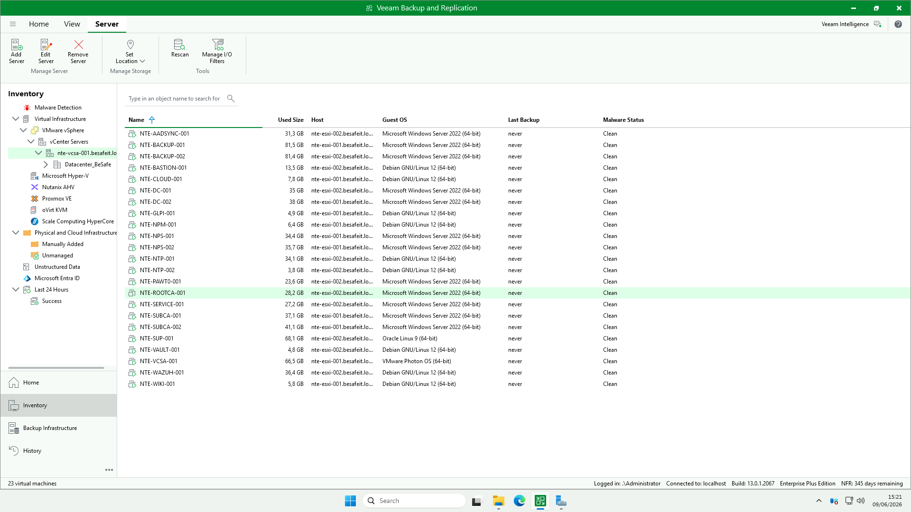
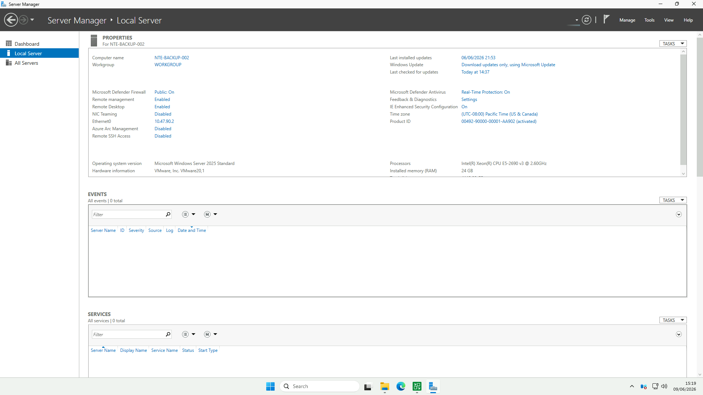
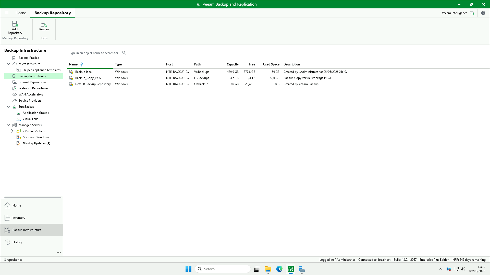
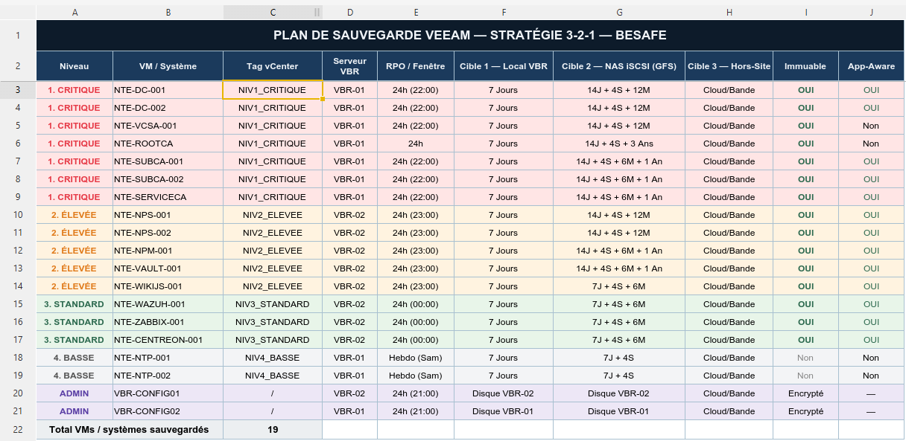
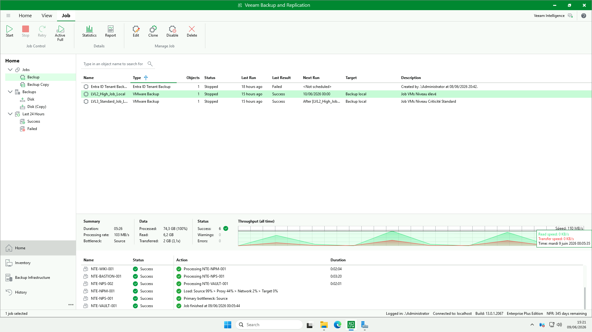

# 💾 Configuration de la sauvegarde Veeam Backup & Replication

> Cette page documente l’infrastructure de sauvegarde **Veeam Backup & Replication** de l’environnement **BESAFE**.
> Elle couvre la **stratégie 3-2-1**, l’**inventaire des VM protégées**, les **repositories**, les **jobs** et le **serveur VBR**.

---

## ⚙️ Détails techniques

| Élément | Valeur |
|:--|:--|
| **Produit** | Veeam Backup & Replication |
| **Build** | 13.0.1.2067 |
| **Édition** | Enterprise Plus (NFR – 345 jours restants) |
| **Serveur VBR (cette console)** | `NTE-BACKUP-002` |
| **Connexion** | localhost (`.\Administrator`) |
| **Hyperviseur protégé** | VMware vSphere – vCenter `nte-vcsa-001.besafeit.local` |
| **Datacenter** | `Datacenter_BeSafe` |

---

## 🖥️ Étape 1 : Infrastructure protégée (Inventory)

> Objectif : connecter Veeam au **vCenter** afin de découvrir et protéger les machines virtuelles de l’environnement.

### 📸 Capture 1 – Inventaire vCenter

L’arborescence d’inventaire est rattachée à :

- **VMware vSphere** → **vCenter Servers** → `nte-vcsa-001.besafeit.local` → `Datacenter_BeSafe`
- Les hôtes ESXi sont `nte-esxi-001` et `nte-esxi-002` (`.besafeit.local`)

> 💡 D’autres hyperviseurs sont disponibles dans la console (Hyper-V, Nutanix, Proxmox, oVirt, Scale Computing) mais **seul VMware vSphere est utilisé** sur BESAFE.

**23 machines virtuelles** sont découvertes via le vCenter. Extrait :

| VM | Taille utilisée | Hôte ESXi | OS invité |
|:--|:--|:--|:--|
| `NTE-DC-001` / `NTE-DC-002` | 35 / 38 GB | esxi-002 | Windows Server 2022 |
| `NTE-VCSA-001` | 66,5 GB | esxi-001 | VMware Photon OS |
| `NTE-ROOTCA-001` | 28,2 GB | esxi-002 | Windows Server 2022 |
| `NTE-SUBCA-001` / `002` | 37,1 / 41,1 GB | esxi-001 | Windows Server 2022 |
| `NTE-SERVICE-001` | 27,2 GB | esxi-002 | Windows Server 2022 |
| `NTE-NPS-001` / `002` | 34,4 / 35,7 GB | esxi-001 | Windows Server 2022 |
| `NTE-NPM-001` | 6,4 GB | esxi-001 | Debian GNU/Linux 12 |
| `NTE-VAULT-001` | 4,8 GB | esxi-001 | Debian GNU/Linux 12 |
| `NTE-WIKI-001` | 5,8 GB | esxi-001 | Debian GNU/Linux 12 |
| `NTE-GLPI-001` | 4,9 GB | esxi-001 | Debian GNU/Linux 12 |
| `NTE-CLOUD-001` | 7,8 GB | esxi-001 | Debian GNU/Linux 12 |
| `NTE-WAZUH-001` | 36,4 GB | esxi-002 | Debian GNU/Linux 12 |
| `NTE-SUP-001` | 68,1 GB | esxi-002 | Oracle Linux 9 |
| `NTE-BASTION-001` | 13,5 GB | esxi-002 | Debian GNU/Linux 12 |
| `NTE-PAWT0-001` | 23,6 GB | esxi-002 | Windows Server 2022 |
| `NTE-AADSYNC-001` | 31,3 GB | esxi-002 | Windows Server 2022 |
| `NTE-NTP-001` / `002` | 34,1 / 3,8 GB | esxi-002 | Debian GNU/Linux 12 |
| `NTE-BACKUP-001` / `002` | 81,5 / 81,4 GB | esxi-001 / 002 | Windows Server 2022 |

> ⚠️ La colonne **Malware Status** affiche **Clean** pour toutes les VM, mais **Last Backup = never** sur l’inventaire : à vérifier (rattachement job ↔ VM, ou inventaire non rafraîchi malgré des jobs en succès — voir Étape 6).

---

## 🗄️ Étape 2 : Serveur de sauvegarde (VBR)

> Objectif : héberger le rôle Veeam Backup & Replication et les repositories locaux.

### 📸 Capture 3 – Serveur `NTE-BACKUP-002`

| Paramètre | Valeur |
|:--|:--|
| **Nom** | `NTE-BACKUP-002` |
| **OS** | Microsoft Windows Server 2025 Standard |
| **Adresse IP** | 10.47.90.2 (VLAN 90 – BACKUP) |
| **Processeur** | Intel Xeon E5-2690 v3 @ 2.60 GHz |
| **Mémoire** | 24 Go |
| **Plateforme** | VM VMware |
| **Pare-feu Defender** | Public : On |
| **Remote Desktop** | Activé |
| **Defender Antivirus** | Real-Time Protection : On |

> 🔒 Le serveur est sur le **VLAN 90 (BACKUP)**, réseau dédié et isolé pour les flux de sauvegarde.
> ⚠️ Veeam signale **Missing Updates (1)** sur les Managed Servers : à corriger.

---

## 📦 Étape 3 : Repositories de sauvegarde

> Objectif : définir les emplacements de stockage des points de restauration (local + copie iSCSI).

### 📸 Capture 4 – Backup Repositories

| Repository | Type | Chemin | Capacité | Libre | Utilisé | Rôle |
|:--|:--|:--|:--|:--|:--|:--|
| `Backup local` | Windows | `V:\Backups` | 439,9 GB | 377,8 GB | 59 GB | Cible primaire (Cible 1) |
| `Backup_Copy_ISCSI` | Windows | `F:\Backups` | 3,5 TB | 3,4 TB | 77,6 GB | Backup Copy vers stockage iSCSI (Cible 2) |
| `Default Backup Repository` | Windows | `C:\Backup` | 89 GB | 29,4 GB | 0 B | Repository par défaut (non utilisé) |

> 💡 La règle **3-2-1** s’appuie sur ces deux cibles : `Backup local` (V:) en primaire, puis **Backup Copy** vers `Backup_Copy_ISCSI` (F:, GFS sur NAS iSCSI).
> 🧹 Le `Default Backup Repository` (C:) reste vide (0 B) — à conserver inutilisé pour ne pas remplir le disque système.

---

## 🎯 Étape 4 : Stratégie 3-2-1 (Plan de sauvegarde)

> Objectif : appliquer la règle **3-2-1** (3 copies, 2 supports, 1 hors-site) avec des niveaux de criticité et de la rétention **GFS**.

### 📸 Capture 5 – Plan de sauvegarde BESAFE

**Principe : 3 copies · 2 supports différents · 1 hors-site**, modulé par niveau de criticité.

| Niveau | VM / Système | Tag vCenter | VBR | RPO / Fenêtre | Cible 1 (Local) | Cible 2 (NAS iSCSI – GFS) | Cible 3 (Hors-site) | Immuable | App-Aware |
|:--|:--|:--|:--|:--|:--|:--|:--|:--:|:--:|
| 🔴 1. Critique | NTE-DC-001 | NIV1_CRITIQUE | VBR-01 | 24h (22:00) | 7 jours | 14J + 4S + 12M | Cloud/Bande | ✅ | ✅ |
| 🔴 1. Critique | NTE-DC-002 | NIV1_CRITIQUE | VBR-01 | 24h (22:00) | 7 jours | 14J + 4S + 12M | Cloud/Bande | ✅ | ✅ |
| 🔴 1. Critique | NTE-VCSA-001 | NIV1_CRITIQUE | VBR-01 | 24h (22:00) | 7 jours | 14J + 4S + 12M | Cloud/Bande | ✅ | Non |
| 🔴 1. Critique | NTE-ROOTCA | NIV1_CRITIQUE | VBR-01 | 24h | 7 jours | 14J + 4S + 3 ans | Cloud/Bande | ✅ | Non |
| 🔴 1. Critique | NTE-SUBCA-001 | NIV1_CRITIQUE | VBR-01 | 24h (22:00) | 7 jours | 14J + 4S + 6M + 1 an | Cloud/Bande | ✅ | ✅ |
| 🔴 1. Critique | NTE-SUBCA-002 | NIV1_CRITIQUE | VBR-01 | 24h (22:00) | 7 jours | 14J + 4S + 6M + 1 an | Cloud/Bande | ✅ | ✅ |
| 🔴 1. Critique | NTE-SERVICEA | NIV1_CRITIQUE | VBR-01 | 24h (22:00) | 7 jours | 14J + 4S + 6M + 1 an | Cloud/Bande | ✅ | ✅ |
| 🟠 2. Élevée | NTE-NPS-001 | NIV2_ELEVEE | VBR-02 | 24h (23:00) | 7 jours | 14J + 4S + 12M | Cloud/Bande | ✅ | ✅ |
| 🟠 2. Élevée | NTE-NPS-002 | NIV2_ELEVEE | VBR-02 | 24h (23:00) | 7 jours | 14J + 4S + 12M | Cloud/Bande | ✅ | ✅ |
| 🟠 2. Élevée | NTE-NPM-001 | NIV2_ELEVEE | VBR-02 | 24h (23:00) | 7 jours | 14J + 4S + 6M + 1 an | Cloud/Bande | ✅ | ✅ |
| 🟠 2. Élevée | NTE-VAULT-001 | NIV2_ELEVEE | VBR-02 | 24h (23:00) | 7 jours | 14J + 4S + 6M + 1 an | Cloud/Bande | ✅ | ✅ |
| 🟠 2. Élevée | NTE-WIKIJS-001 | NIV2_ELEVEE | VBR-02 | 24h (23:00) | 7 jours | 7J + 4S + 6M | Cloud/Bande | ✅ | ✅ |
| 🟢 3. Standard | NTE-WAZUH-001 | NIV3_STANDARD | VBR-02 | 24h (00:00) | 7 jours | 7J + 4S + 6M | Cloud/Bande | ✅ | ✅ |
| 🟢 3. Standard | NTE-ZABBIX-001 | NIV3_STANDARD | VBR-02 | 24h (00:00) | 7 jours | 7J + 4S + 6M | Cloud/Bande | ✅ | ✅ |
| 🟢 3. Standard | NTE-CENTREON-001 | NIV3_STANDARD | VBR-02 | 24h (00:00) | 7 jours | 7J + 4S + 6M | Cloud/Bande | ✅ | ✅ |
| 🔵 4. Basse | NTE-NTP-001 | NIV4_BASSE | VBR-01 | Hebdo (Sam) | 7 jours | 7J + 4S | Cloud/Bande | Non | Non |
| 🔵 4. Basse | NTE-NTP-002 | NIV4_BASSE | VBR-01 | Hebdo (Sam) | 7 jours | 7J + 4S | Cloud/Bande | Non | Non |
| 🟣 Admin | VBR-CONFIG01 | / | VBR-02 | 24h (21:00) | Disque VBR-02 | Disque VBR-02 | Cloud/Bande | Encrypté | — |
| 🟣 Admin | VBR-CONFIG02 | / | VBR-01 | 24h (21:00) | Disque VBR-01 | Disque VBR-01 | Cloud/Bande | Encrypté | — |

> **Total VM / systèmes sauvegardés : 19**

**Légende des rétentions (GFS) :** `J` = jours · `S` = semaines · `M` = mois.
Exemple : `14J + 4S + 12M` = 14 restaurations journalières + 4 hebdomadaires + 12 mensuelles.

> 🧩 Les niveaux sont pilotés par **tags vCenter** (`NIV1_CRITIQUE` … `NIV4_BASSE`), ce qui permet d’assigner automatiquement une VM au bon job selon son tag.
> 📝 Le plan vise **19 systèmes** alors que **23 VM** sont découvertes : l’écart correspond aux VM non encore intégrées au plan (`NTE-AADSYNC-001`, `NTE-GLPI-001`, `NTE-CLOUD-001`, `NTE-PAWT0-001`, `NTE-BACKUP-001/002`…) — à arbitrer.

---

## 🔁 Étape 5 : Jobs de sauvegarde

> Objectif : organiser les jobs par niveau de criticité, avec chaînage (le job Standard démarre après le job Élevé).

### 📸 Capture 6 – Vue des jobs

| Job | Type | Dernier résultat | Prochaine exécution | Cible | Description |
|:--|:--|:--|:--|:--|:--|
| `LVL2_High_Job_Local` | VMware Backup | 🟢 Success | 10/06/2026 00:00 | Backup local | Job VMs Niveau élevé |
| `LVL3_Standard_Job_L…` | VMware Backup | 🟢 Success | Après `LVL2_High_Job…` | Backup local | Job VMs Niveau Criticité Standard |
| `Entra ID Tenant Backup` | Entra ID Tenant Backup | 🔴 Failed | `<Not scheduled>` | — | Sauvegarde du tenant Entra ID |

> ⛓️ Le job **Standard** est **chaîné** après le job **Élevé** (`After [LVL2_High_Job…]`) pour éviter la contention de ressources.
> ⚠️ Le job **Entra ID Tenant Backup** est en **échec** et **non planifié** : à diagnostiquer (connecteur Entra ID / permissions).

---

## ✅ Résumé global

| Étape | Élément | Description | État |
|:--|:--|:--|:--:|
| 1️⃣ | **Inventaire** | vCenter `nte-vcsa-001` – 23 VM découvertes | ✅ |
| 2️⃣ | **Serveur VBR** | `NTE-BACKUP-002` (VLAN 90) | ⚠️ (1 MAJ) |
| 3️⃣ | **Repositories** | Local (V:) + Copy iSCSI (F:) | ✅ |
| 4️⃣ | **Stratégie 3-2-1** | 4 niveaux + GFS + tags vCenter | ✅ |
| 5️⃣ | **Jobs** | LVL2 / LVL3 OK · Entra ID en échec | ⚠️ |
| 6️⃣ | **Exécution** | Job LVL2 : 6 VM, 0 erreur | ✅ |

---

## 🔗 Liens utiles

- [Veeam Backup & Replication – Documentation officielle](https://helpcenter.veeam.com/docs/backup/vsphere/overview.html)
- [Règle 3-2-1 expliquée par Veeam](https://www.veeam.com/blog/321-backup-rule.html)
- [Rétention GFS (Grandfather-Father-Son)](https://helpcenter.veeam.com/docs/backup/vsphere/gfs_retention_policy.html)
- [Backup immuable (immutability)](https://www.veeam.com/data-backup-immutability.html)
