# 🖥️ Installation et configuration de VMware ESXi

> Cette page décrit l’installation et la configuration initiale d’un hôte **VMware ESXi 8.0** dans le cadre du projet **BESAFE**.

---

## ⚙️ Détails techniques

| Élément | Valeur |
|:--|:--|
| **Version** | VMware ESXi 8.0 |
| **Matériel** | 24 CPUs x Intel(R) Xeon(R) CPU E5-2690 v3 @ 2.60GHz – 256 Go RAM |
| **Rôle** | Hyperviseur de virtualisation (Cluster BESAFE) |
| **Objectif** | Héberger les VMs d’infrastructure (AD, PKI, GLPI, etc.) |

---

🚀 Étape 1 : Installation de l’hyperviseur

### 📸 Capture 1 – Chargement du programme d’installation
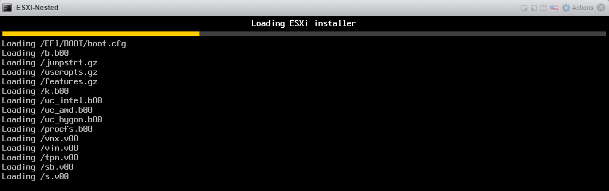

L’installeur ESXi se charge depuis le média bootable (clé USB ou ISO).  
On voit ici les modules système et drivers (`boot.cfg`, `vmk`, etc.) être chargés en mémoire.

---

### 📸 Capture 2 – Initialisation du VMkernel
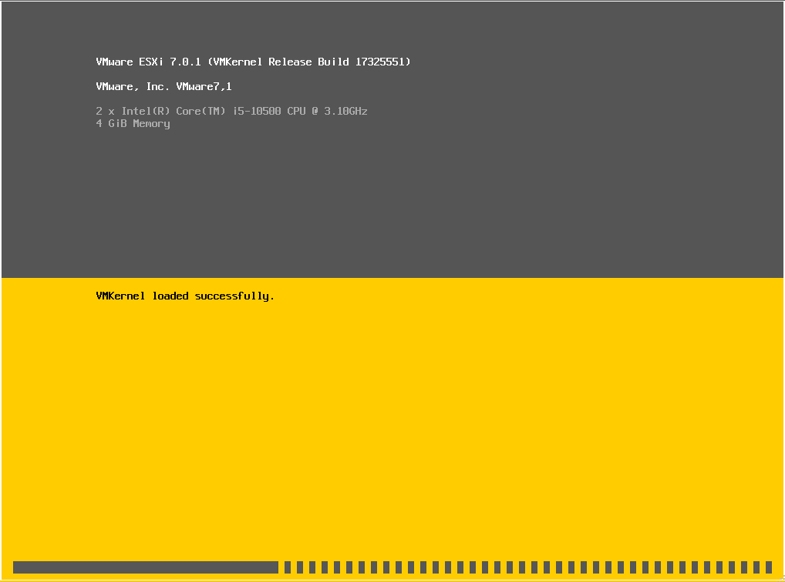

Le noyau **VMkernel** de VMware se charge et détecte le matériel physique.  
Cette étape vérifie la compatibilité CPU, mémoire et pilotes.

---

### 📸 Capture 3 – Définition du mot de passe root
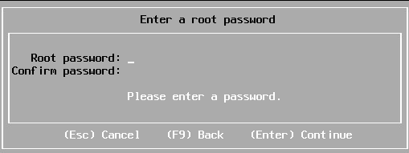

L’assistant demande de définir le **mot de passe administrateur (root)**.  
Celui-ci servira pour la console DCUI et la gestion web de l’hôte.

---

### 📸 Capture 4 – Fin de l’installation
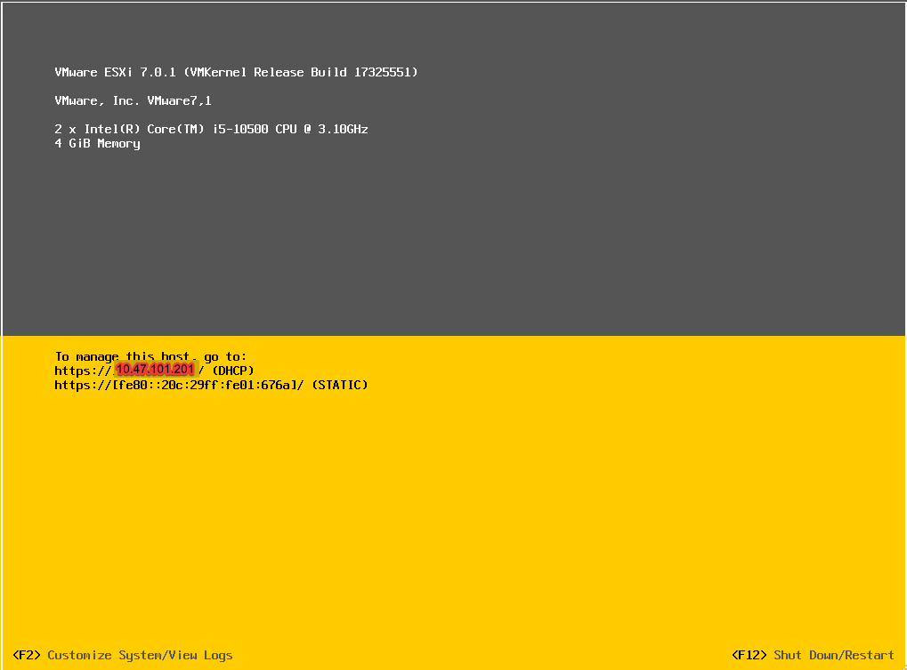

Une fois l’installation complétée, le système affiche l’adresse IP attribuée (ici en DHCP).  
L’hôte est prêt à être configuré via la **console locale (DCUI)**.

---

🌐 Étape 2 : Configuration réseau de gestion

### 📸 Capture 5 – Accès au menu DCUI
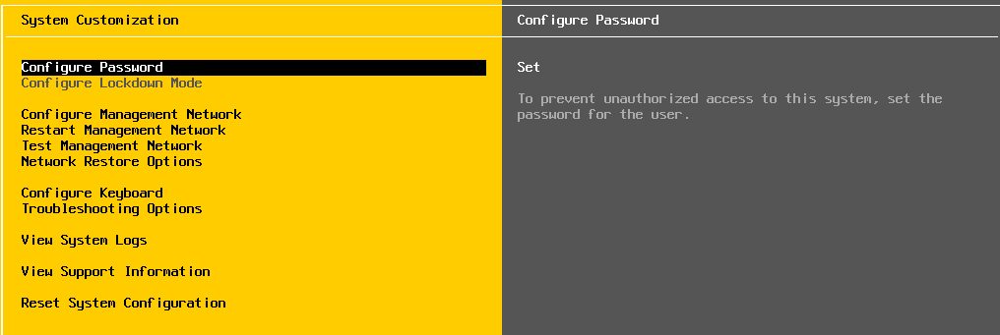

Depuis la console physique ou IPMI, appuyer sur **F2** → `Configure Management Network`.  
C’est ici que l’on définit l’adaptateur réseau, le VLAN et l’adressage IP de gestion.

---

### 📸 Capture 6 – Choix de l’adaptateur réseau
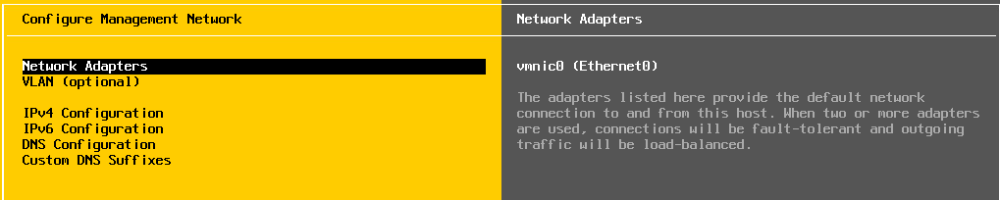

Par défaut, l’adaptateur **vmnic0** est sélectionné pour la gestion.  
Il est possible d’ajouter des interfaces supplémentaires ou d’activer la tolérance de panne.

---

### 📸 Capture 7 – Configuration IPv4 statique
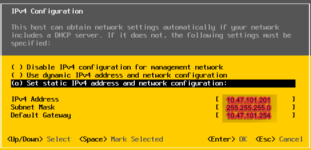

Sélectionner **“Set static IPv4 address”** et renseigner les paramètres

---

### 📸 Capture 8 – Page de connexion VMware Host Client
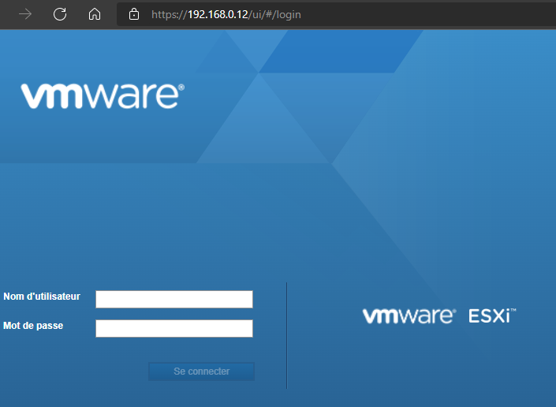

L’accès se fait via l’URL :  
👉 `https://10.47.101.X/ui`  

Connectez-vous avec le compte **"root"**

---

### 📸 Capture 9 – Tableau de bord de l’hôte
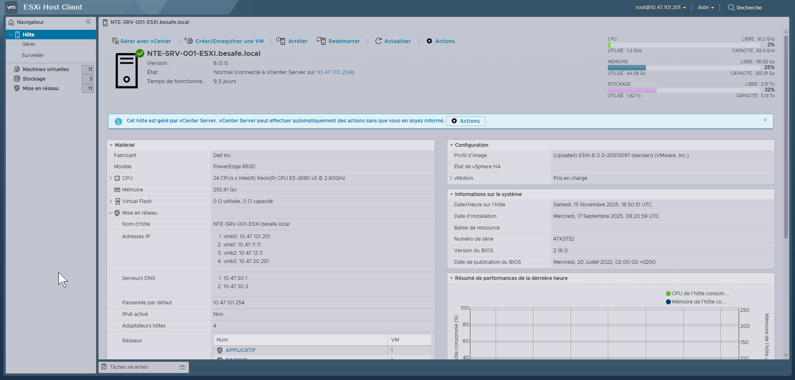

L’interface web **VMware Host Client** affiche :
- Le matériel détecté (CPU, RAM, stockage)  
- L’état du réseau de gestion  
- Les VMs et datastores (une fois créés)  
- Les informations de licence et de build  

> ℹ️ L’hôte peut ensuite être ajouté à **vCenter Server** pour intégration dans le cluster BESAFE.

---

🌐 Étape 3 : Configuration réseau avancée (vSwitch)

> Objectif : créer un **commutateur virtuel standard (vSwitch)** afin de segmenter le trafic réseau de l’hôte ESXi (par exemple pour iSCSI, DMZ, management, etc.).

---

### 🧭 Introduction

Dans VMware ESXi, les **vSwitch (Virtual Switch)** permettent de relier :
- les **interfaces physiques** de l’hôte (vmnic),
- les **groupes de ports virtuels** (VM Network, iSCSI Network, etc.),
- et les **VMkernel adapters** utilisés pour la gestion, le vMotion ou le stockage.

---

### 📸 Capture 10 – Accéder à la section “Mise en réseau”
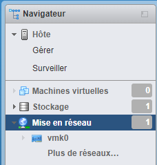

Depuis le navigateur ESXi, ouvrir le menu de gauche :
Hôte → Mise en réseau → Commutateurs virtuels
Cette interface affiche les **commutateurs existants** (par défaut : `vSwitch0`) et permet d’en ajouter de nouveaux pour séparer les flux.

---

### 📸 Capture 11 – Ajouter un nouveau commutateur virtuel
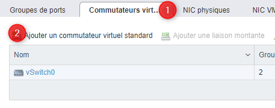

Cliquer sur :
Ajouter un commutateur virtuel standard

Un assistant s’ouvre pour créer un nouveau **vSwitch** et y associer une interface physique (uplink).

---

### 📸 Capture 12 – Paramétrage du vSwitch
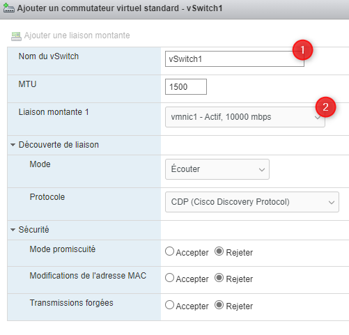

Remplir les champs comme suit :

| Paramètre | Valeur recommandée | Description |
|:--|:--|:--|
| **Nom du vSwitch** | `vSwitch1` | Identifiant du nouveau commutateur virtuel |
| **MTU** | `1500` | Taille standard des paquets (jumbo frames si iSCSI) |
| **Liaison montante 1** | `vmnic1` | Interface physique associée (10 Gbps) |
| **Mode découverte** | CDP (Cisco Discovery Protocol) | Pour détecter les voisins réseau |
| **Promiscuité / MAC / Forged Transmit** | Rejeter | Sécurise les échanges |

> 💡 Ce vSwitch pourra ensuite héberger un **groupe de ports dédié à l’iSCSI** ou à d’autres VLAN applicatifs.

---

### 📸 Capture 13 – Validation du vSwitch
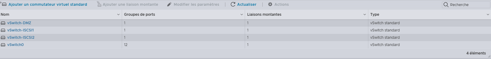

Le nouveau commutateur **vSwitch1** apparaît dans la liste.  
Il est maintenant **actif** et relié à la carte réseau physique `vmnic1`.

> ✅ Vérifie que l’état est « Actif » et que la vitesse affichée correspond à ton interface (1 Gbps ou 10 Gbps).

---

### 📸 Capture 14 – Visualiser la topologie
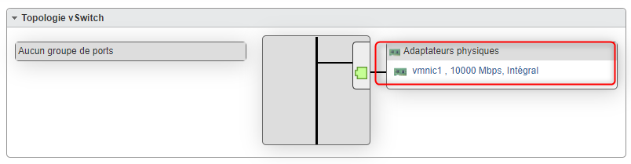

Dans la section « Topologie du vSwitch », tu visualises :
- à gauche : les **groupes de ports** (par défaut, vide)  
- à droite : les **interfaces physiques** connectées (`vmnic1`)

Cela permet de vérifier la correspondance entre ton **infrastructure virtuelle (vSwitch)** et la **connectique réelle (NIC physique)**.

---

### ⚙️ Bonnes pratiques de configuration

| Élément | Recommandation | Explication |
|:--|:--|:--|
| **Séparation des flux** | Un vSwitch par type de trafic | Exemple : vSwitch0 = Management, vSwitch1 = iSCSI, vSwitch2 = DMZ |
| **MTU** | 9000 pour iSCSI ou vMotion | Optimise les transferts volumineux |
| **CDP/LLDP** | Activer (Listen/Advertise) | Permet la détection par les switchs Cisco ou compatibles |
| **Sécurité** | Rejeter Promiscuous/MAC Change/Forged | Renforce la sécurité du réseau virtuel |

---

### 🧩 Étape suivante

Une fois ton **vSwitch créé**, tu peux :
- Ajouter des **groupes de ports** pour y rattacher des VMs ou VMkernel adapters  
- Configurer les **réseaux iSCSI, vMotion ou management secondaire**

---

---

🌐 Étape 4 : Création d’un groupe de ports (Port Group)

> Objectif : créer un **groupe de ports virtuel** rattaché à un **vSwitch**, afin de définir un réseau logique isolé (avec ou sans VLAN).

---

### 🧭 Introduction

Les **groupes de ports** dans ESXi servent à :
- connecter des **machines virtuelles** à un réseau virtuel,  
- appliquer des **paramètres de sécurité ou de VLAN**,  
- et définir le lien entre un **vSwitch** et un **VLAN spécifique**.

Chaque port group correspond à un **réseau virtuel distinct**.

---

### 📸 Capture 15 – Accéder aux groupes de ports

Depuis le menu principal ESXi :
Hôte → Mise en réseau → Groupes de ports

Cette vue liste les réseaux déjà configurés, comme :
- **Management Network** : réseau de gestion d’ESXi  
- **VM Network** : réseau des machines virtuelles  

---

### 📸 Capture 16 – Ajouter un nouveau groupe de ports
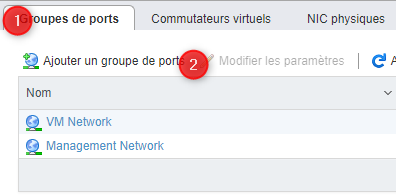

Cliquer sur :
Ajouter un groupe de ports

Un assistant s’ouvre pour définir le **nom**, le **VLAN** et le **vSwitch associé**.

---

### 📸 Capture 17 – Configuration du groupe de ports
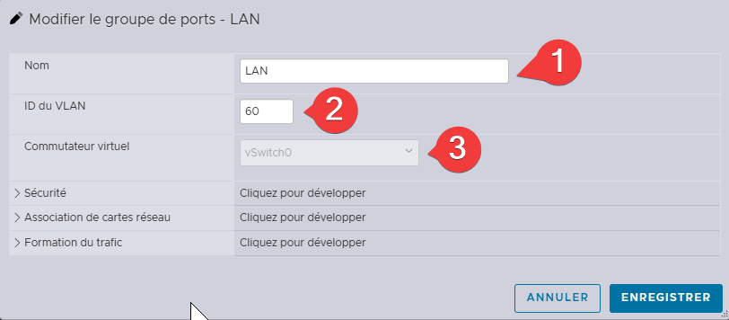

Remplir les champs suivants :

| Paramètre | Valeur | Description |
|:--|:--|:--|
| **Nom** | `LAN` | Nom du réseau virtuel |
| **ID du VLAN** | `60` | VLAN associé au réseau |
| **Commutateur virtuel** | `vSwitch0` | vSwitch créé précédemment |
| **Mode promiscuité / MAC / Forged** | Rejeter | Recommandé pour la sécurité |

> 💡 Le VLAN ID `60` correspond au réseau “LAN” défini dans ton plan d’adressage BESAFE.

---

### 📸 Capture 18 – Validation du groupe de ports
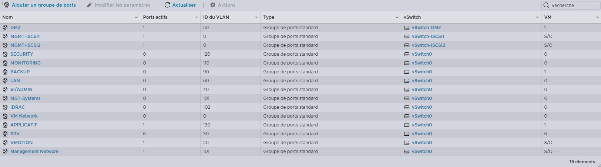

Une fois ajouté, le groupe **Domotique** apparaît dans la liste :
- **Ports actifs :** 0 (en attente de VM connectée)  
- **ID VLAN :** 60
- **Commutateur :** vSwitch0  

> ✅ Vérifie la présence du VLAN dans la topologie du vSwitch pour confirmer la liaison.

---

### 📸 Capture 19 – Visualiser la topologie du vSwitch
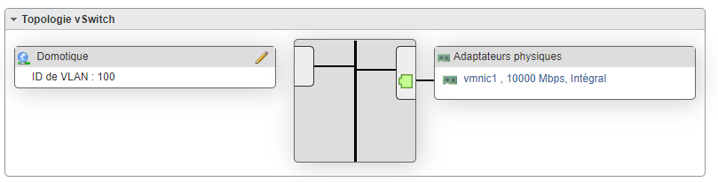

Dans la section “Topologie vSwitch”, tu vois :
- à gauche : le **groupe Domotique (VLAN 100)**  
- à droite : l’**interface physique vmnic1 (10 Gbps)**  

> Cette vue garantit que le groupe de ports est correctement associé à la carte physique du vSwitch.

---

### ⚙️ Bonnes pratiques

| Élément | Recommandation | Explication |
|:--|:--|:--|
| **Nom explicite** | Utiliser le nom du service ou VLAN | Ex : `iSCSI`, `DMZ`, `Backup`, `LAN` |
| **VLAN ID** | Doit correspondre à ton plan IP | Vérifie avec ton schéma réseau |
| **Isolation** | Un groupe = un VLAN | Évite les interférences entre services |
| **Sécurité** | Rejeter les paquets non conformes | Protège des spoofings ou boucles réseau |

---

### 🧩 Étape suivante

Une fois ton groupe de ports créé :
- Tu peux y **connecter des machines virtuelles** ou des **interfaces VMkernel**,  
- Et associer ce réseau à un **datastore iSCSI**, une **DMZ**, ou tout autre usage spécifique.

---

---

🔐 Étape 5 : Intégration d’ESXi à Active Directory

> Objectif : joindre l’hôte **VMware ESXi** au domaine **Active Directory (AD)** afin de permettre l’authentification centralisée des administrateurs et renforcer la gestion des accès.

---

### 🧭 Introduction

L’intégration d’ESXi dans un domaine **Active Directory** permet :
- une **authentification unifiée** avec les comptes du domaine,  
- une **gestion des permissions** par groupes AD,  
- et une **traçabilité centralisée** des connexions administratives.

> ⚙️ Exemple utilisé : domaine **besafe.local**, contrôlé par **NTE-DC-001.besafe.local**

---

### 📸 Capture 20 – Accéder à la configuration d’authentification
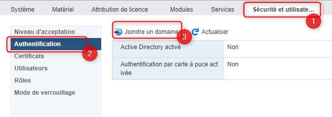

Depuis l’interface web d’ESXi :
Sécurité et utilisateurs → Authentification

Puis cliquer sur **« Joindre un domaine »** pour démarrer la configuration.

---

### 📸 Capture 21 – Renseigner les informations du domaine
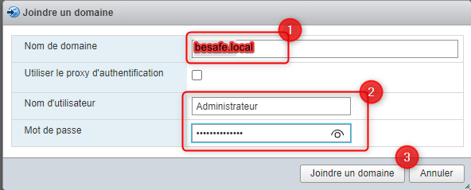

Remplir les champs suivants :

| Champ | Valeur | Description |
|:--|:--|:--|
| **Nom de domaine** | `besafe.local` | Nom complet du domaine AD |
| **Nom d’utilisateur** | `Administrateur` | Compte autorisé à joindre des ordinateurs au domaine |
| **Mot de passe** | `********` | Mot de passe du compte AD |

> 💡 Ne pas cocher “Utiliser le proxy d’authentification” (option inutile dans la plupart des cas).

---

### 📸 Capture 22 – Validation de la jonction
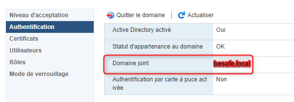

Une fois la jonction réussie :
- **Active Directory activé :** Oui  
- **Statut d’appartenance :** OK  
- **Domaine joint :** BESAFE.LOCAL  

L’hôte est désormais reconnu dans le domaine et utilisable avec des comptes AD.

---

### 📸 Capture 23 – Vérification dans Active Directory
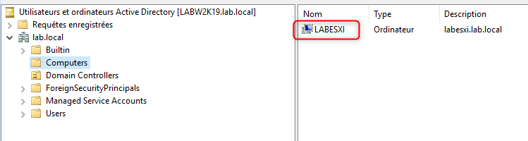

Depuis la console **Active Directory Users and Computers**, vérifier que l’objet de l’hôte est bien créé :
besafe.local → Computers → NTE-ESXI-001

> ✅ Cela confirme l’inscription réussie de l’hôte ESXi dans le domaine AD.

---

### ⚙️ Bonnes pratiques

| Élément | Recommandation | Explication |
|:--|:--|:--|
| **Compte utilisé** | Utiliser un compte d’administration dédié | Éviter d’utiliser `Administrateur` du domaine par défaut |
| **DNS** | Pointer ESXi vers les DNS du domaine | Sinon la jonction échouera |
| **Heure système** | Synchroniser avec le contrôleur de domaine | La désynchronisation entraîne des erreurs Kerberos |
| **Groupes AD** | Créer un groupe `ESXi-Admins` dans AD | Pour déléguer les droits sans utiliser le compte root |

---

### 🧩 Étape suivante

Une fois l’hôte intégré :
- Configurer les **rôles et utilisateurs AD** dans l’interface ESXi,  
- Puis **tester la connexion avec un compte de domaine**.  

---

---

🔒 Étape 6 : Configuration du certificat SSL

❌ EN COURS DE RÉDACTION  
 Cette section détaillera la configuration d’un **certificat SSL personnalisé** sur l’hôte ESXi.

---

🧾 Étape 7 : Personnalisation de la bannière de connexion

### 📸 Capture 24 – Paramètres avancés
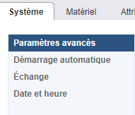

Depuis la console **ESXi**, allez dans les paramètres avancés :
Hôte → Système → Paramètres avancés
  
### 📸 Capture 25 – Paramètre Welcome Message
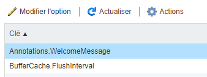

Depuis l'onglet **Système**, modifiez la valeur Welcome Message
  
### 📸 Capture 26 – Welcome Message
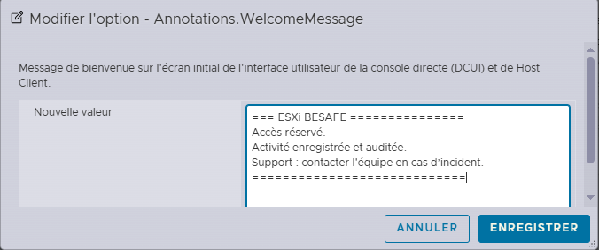
  
### 📸 Capture 27 – Vérification de la bannière de connexion
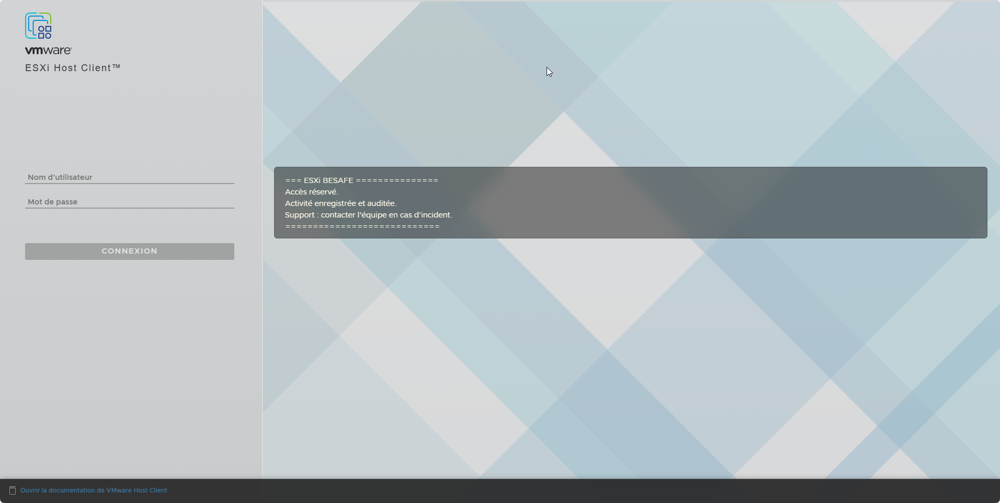

Depuis la page de connexion **Esxi**, vérifier que la bannière de l’hôte est bien créé

> ✅ La bannière de connexion est maintenant configuré  

---

## ✅ Résumé des étapes

| Étape | Objectif | Résultat attendu |
|:--|:--|:--|
| 1️⃣ **Installation** | Déployer ESXi depuis l’ISO d’installation | Hôte opérationnel et accessible en console |
| 2️⃣ **Configuration réseau (DCUI)** | Définir une IP statique, DNS et passerelle | Accès stable à l’interface web |
| 3️⃣ **Création d’un vSwitch** | Segmenter le trafic réseau | Commutateur virtuel prêt à l’emploi |
| 4️⃣ **Création d’un groupe de ports** | Associer un VLAN à un vSwitch | Réseau virtuel “Domotique” (VLAN 100) créé 
| 5️⃣ **Intégration Active Directory** | Joindre ESXi au domaine AD | Authentification centralisée via AD |
| 6️⃣ **Certificat SSL** | Sécuriser les connexions HTTPS | 🔴 *En cours de rédaction* |
| 7️⃣ **Bannière de connexion** | Ajouter un message d’avertissement | Bannière à l'authentification |

---

## 🔗 Liens utiles

- [Documentation officielle VMware ESXi](https://docs.vmware.com/fr/VMware-vSphere/index.html)
- [Guide vCenter Server](/vCenter)
- [Schéma BESAFE](/Infrastructure/Schéma)
