# 🖥️ Installation et configuration de VMware ESXi

> Cette page décrit l’installation et la configuration initiale d’un hôte **VMware ESXi 8.0** dans le cadre du projet **BESAFE**.

---

## ⚙️ Détails techniques

| Élément | Valeur |
|:--|:--|
| **Version** | VMware ESXi 8.0 |
| **Matériel** | 24 CPUs x Intel(R) Xeon(R) CPU E5-2690 v3 @ 2.60GHz – 256 Go RAM |
| **Rôle** | Hyperviseur de virtualisation (Cluster BESAFE) |
| **Objectif** | Héberger les VMs d’infrastructure (AD, PKI, GLPI, etc.) |

---

## 🌐 Étape 1 : Configuration réseau de management

> Cette section décrit la configuration réseau utilisée par l’hôte **ESXi** pour son administration et son intégration dans l’infrastructure **BESAFE**.

La configuration réseau de management permet :

- l’accès à l’interface **ESXi Host Client**
- la résolution DNS interne
- l’intégration dans l’environnement **Active Directory / DNS**
- la communication avec les services d’infrastructure (monitoring, sauvegarde, etc.)

---

### 📡 Configuration IPv4

| Paramètre | Valeur |
|:--|:--|
| **Mode** | Statique |
| **Adresse IP** | `10.47.101.201` |
| **Masque** | `255.255.255.0` |
| **Passerelle** | `10.47.101.254` |

Cette adresse correspond au **réseau de management de l’infrastructure**.

L’accès à l’hyperviseur s’effectue via :
https://10.47.101.201 ou https://nte-esxi-001
  
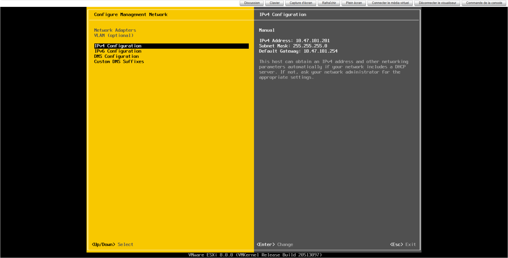

---

### 🧭 Configuration DNS

| Paramètre | Valeur |
|:--|:--|
| **DNS principal** | `10.47.30.1` |
| **DNS secondaire** | `10.47.30.2` |
| **Nom d’hôte** | `nte-esxi-001` |
| **Domaine** | `besafeit.local` |

Les serveurs DNS utilisés sont les **contrôleurs de domaine de l’infrastructure BESAFE**.

Cela permet notamment :

- la résolution des services internes
- l’intégration dans les outils d’administration
- l’utilisation du FQDN pour l’accès à l’hyperviseur

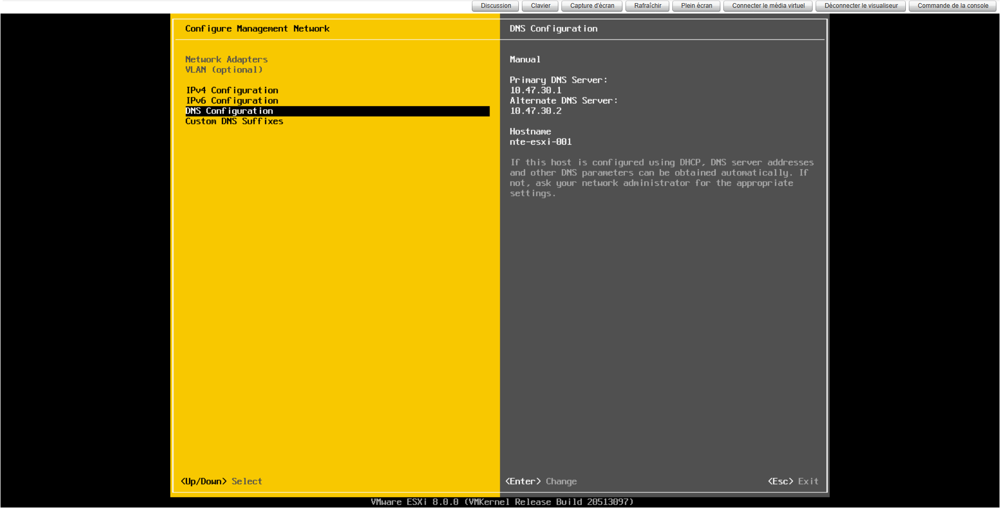

---

### 🔎 Suffixe DNS

| Paramètre | Valeur |
|:--|:--|
| **Search Domain** | `besafeit.local` |

Ce suffixe permet la résolution automatique des noms courts.

Exemple :
nte-esxi-001
  
sera automatiquement résolu vers :
nte-esxi-001.besafeit.local
  
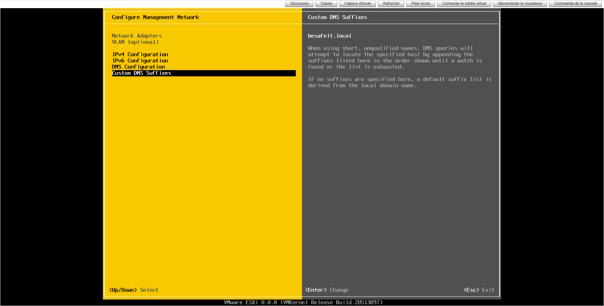

---

### 🧩 Intégration dans l’architecture BESAFE

Le réseau de management ESXi est isolé dans un **VLAN dédié à l’administration de l’infrastructure**.

Cela permet :

- de limiter l’exposition de l’hyperviseur
- de séparer le trafic d’administration du trafic VM
- d’appliquer des règles de sécurité spécifiques

---

### 🎯 Résultat attendu

- accès sécurisé à l’hyperviseur
- résolution DNS interne fonctionnelle
- intégration dans l’infrastructure BESAFE
- isolation du réseau d’administration
  
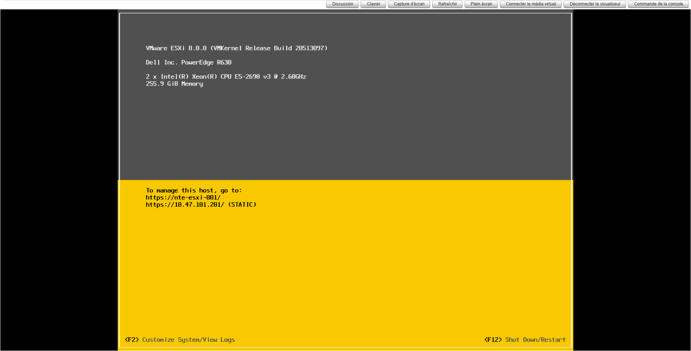

---

## 🔀 Étape 2 : Architecture réseau virtuelle

Cette section décrit l’architecture réseau virtuelle de l’hôte **ESXi nte-esxi-001** au sein de l’infrastructure **BESAFE**.

L’objectif est de comprendre :

- comment les flux sont segmentés
- comment les interfaces VMkernel sont utilisées
- comment les machines virtuelles accèdent au réseau
- comment l’hyperviseur est connecté au réseau physique

---

### 🧠 Architecture générale

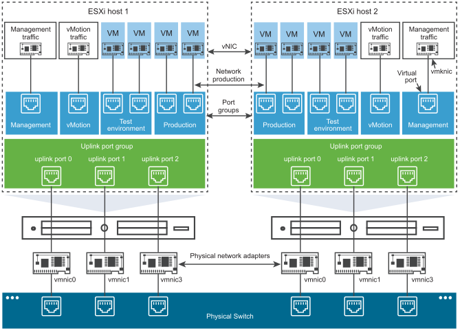
  
Ce schéma illustre le fonctionnement du **réseau virtuel VMware**.

Chaque hôte ESXi possède :

- des **interfaces physiques (vmnic)**
- des **commutateurs virtuels**
- des **interfaces VMkernel**
- des **port groups**

Les flux réseau sont ensuite transportés vers le **switch physique** de l’infrastructure.

---

### 🌐 Interface VMkernel de management

La première interface VMkernel de l’hôte est **vmk0**.

Elle correspond à l’interface utilisée pour :

- l’administration de l’hyperviseur
- l’accès au **ESXi Host Client**
- la communication avec **vCenter**
- les services d’infrastructure

Cette interface est associée au **port group de management**.

Le trafic qui transite par cette interface inclut notamment :

- SSH
- HTTPS
- supervision
- API vSphere

Cette interface constitue donc le **point d’entrée principal de l’hyperviseur**.

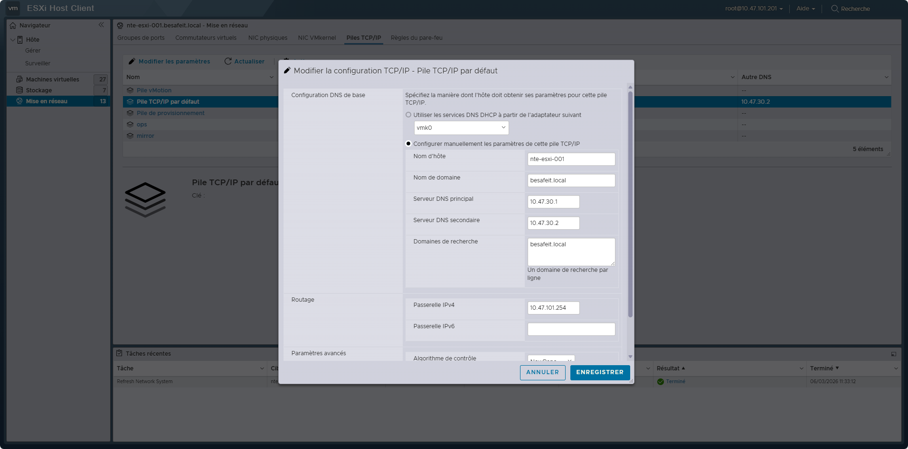

### 🔁 Interfaces VMkernel dédiées aux services

L’hôte dispose également de plusieurs interfaces VMkernel supplémentaires.

Ces interfaces permettent de **séparer les flux critiques de l’infrastructure**.

Dans cette architecture on retrouve :

### vmk1 — réseau iSCSI primaire

Cette interface est utilisée pour la communication avec la baie de stockage via le protocole **iSCSI**.

Elle est rattachée à un **vSwitch dédié au stockage** afin d’isoler complètement ce trafic du reste du réseau.

---

### vmk2 — réseau iSCSI secondaire

Cette interface correspond au **second réseau iSCSI**.

Elle permet :

- le **multipathing**
- la **tolérance de panne**
- une meilleure répartition de charge

Les deux interfaces iSCSI fonctionnent donc sur **deux réseaux distincts**.

---

### vmk3 — réseau vMotion

Cette interface est dédiée au trafic **vMotion**.

Elle permet la migration des machines virtuelles entre les hôtes ESXi sans interruption de service.

Le trafic vMotion est généralement très important en volume, c’est pourquoi il est isolé sur un réseau spécifique.

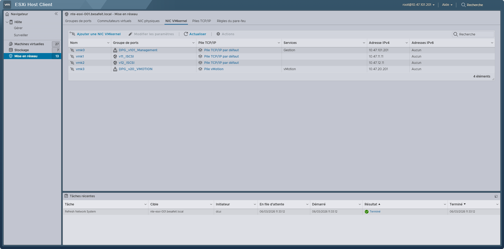

---

L’infrastructure utilise un **vSphere Distributed Switch** nommé :
VDS_TRUNK
  

Le distributed switch permet :

- une configuration réseau centralisée
- une cohérence entre tous les hôtes ESXi
- la gestion centralisée des VLAN
- une administration simplifiée via **vCenter**

Tous les VLAN de l’infrastructure transitent via ce vDS.

---

### 🔌 vSwitch dédiés au stockage

En complément du vDS, l’hôte dispose de deux **vSwitch standards** :

- `VISCSI_11`
- `VISCSI_12`

Ces commutateurs virtuels sont exclusivement utilisés pour le trafic **iSCSI**.

Ce choix d’architecture permet :

- d’isoler totalement le trafic stockage
- d’éviter toute interférence avec le réseau VM
- d’améliorer la performance et la stabilité du stockage

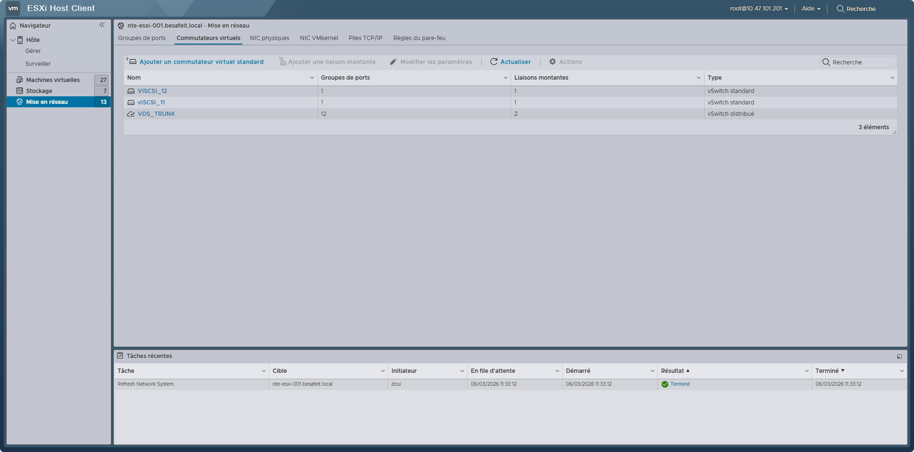

---

### 📦 Port Groups

Les **port groups** sont les points de connexion entre :

- les machines virtuelles
- les réseaux VLAN de l’infrastructure

Chaque port group correspond à un **VLAN spécifique**.

Les machines virtuelles sont ensuite connectées à ces port groups selon leur rôle :

- production
- supervision
- DMZ
- sauvegarde
- services internes

Cela permet d’appliquer une **segmentation réseau stricte** au niveau de la virtualisation.

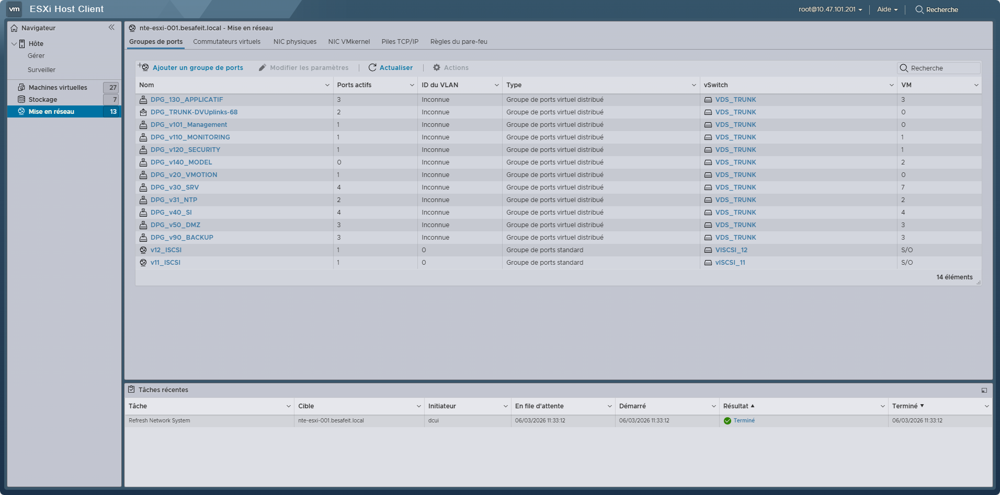

---

### 🔗 Connexion au réseau physique

Les commutateurs virtuels utilisent des **uplinks** reliés aux interfaces physiques de l’hôte.

Ces interfaces sont les **vmnic**.

Elles permettent d’acheminer le trafic vers le **switch physique** de l’infrastructure.

Les VLAN sont transportés via des liens **trunk** afin de permettre à l’hyperviseur d’exposer plusieurs réseaux virtuels.

---

### 🎯 Objectifs de cette architecture

Cette architecture réseau permet :

- la **séparation des flux critiques**
- une **segmentation réseau forte**
- une **meilleure performance**
- une **administration centralisée**
- une **résilience accrue**

Elle constitue la base du fonctionnement réseau de l’infrastructure virtualisée **BESAFE**.

---

## 💾 Étape 3 : Architecture stockage iSCSI

Cette section décrit la configuration du stockage **iSCSI** utilisée par l’hôte ESXi dans l’infrastructure **BESAFE**.

Le protocole iSCSI permet à l’hyperviseur d’accéder à des volumes de stockage distants comme s’il s’agissait de disques locaux.

Ces volumes sont ensuite utilisés pour créer les **datastores VMFS** qui hébergent les machines virtuelles.

---

### 🧠 Principe du stockage iSCSI

Le protocole **iSCSI (Internet Small Computer System Interface)** permet de transporter des commandes SCSI sur un réseau IP.

Dans une architecture VMware, cela permet :

- de connecter les hyperviseurs à une baie de stockage
- de centraliser les disques des machines virtuelles
- de permettre la migration des VM entre hôtes
- d'assurer la haute disponibilité du stockage

L’hyperviseur accède ainsi aux **LUN exposées par la baie de stockage**.

---

### 🔌 Adaptateur iSCSI ESXi

L’hôte utilise un **adaptateur iSCSI logiciel VMware**.

Cet adaptateur apparaît sous la forme :
vmhba64
  
Cet adaptateur permet à ESXi de communiquer avec les **targets iSCSI du stockage**.

Contrairement à une carte HBA matérielle, cet adaptateur fonctionne via les interfaces réseau classiques de l’hyperviseur.

---

### 🔗 Port Binding

Le **port binding** permet d’associer plusieurs interfaces VMkernel à l’adaptateur iSCSI.

Dans l’architecture BESAFE, deux interfaces sont utilisées :

- **vmk1**
- **vmk2**

Chaque interface correspond à un **réseau iSCSI distinct**.

Cette configuration permet d’utiliser plusieurs chemins vers le stockage.

---

### 🔁 Multipathing

L’utilisation de plusieurs interfaces réseau permet d’activer le **multipathing**.

Le multipathing offre plusieurs avantages :

- tolérance de panne réseau
- répartition de charge
- meilleure performance globale
- haute disponibilité du stockage

Si un chemin réseau devient indisponible, ESXi peut automatiquement utiliser un autre chemin.

---

### 🎯 Targets iSCSI

L’hyperviseur se connecte à plusieurs **targets iSCSI exposées par le stockage**.

Ces targets correspondent aux volumes de stockage exportés par la baie.

Chaque target est identifiée par un **IQN (iSCSI Qualified Name)**.

Les connexions sont établies via le port standard : 3260
  
Les différentes LUN présentées par le stockage sont ensuite détectées par l’hyperviseur.

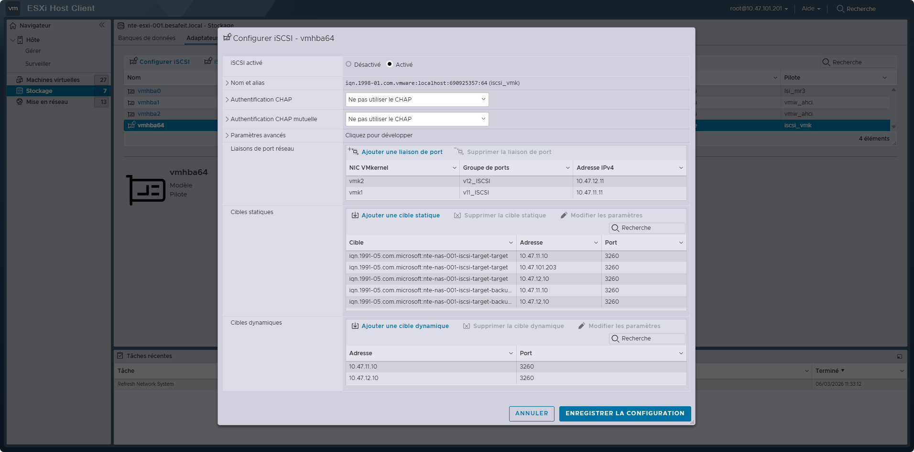

---

### 🗄️ Présentation des LUN

Une fois les targets détectées, ESXi voit apparaître les volumes sous forme de **disques SCSI**.

Ces volumes peuvent ensuite être utilisés pour :

- créer des **datastores VMFS**
- héberger les machines virtuelles
- stocker les templates
- stocker les fichiers ISO

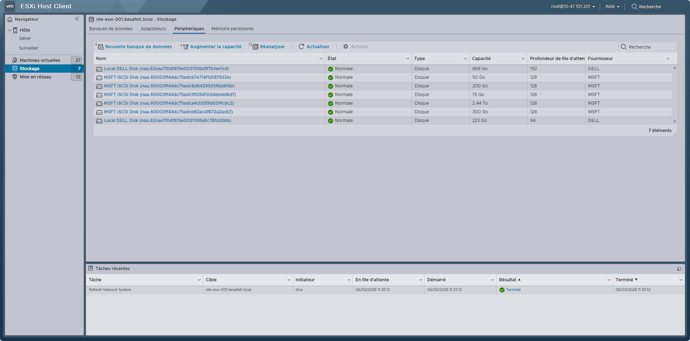

---

### 🧩 Intégration dans l’infrastructure BESAFE

Dans cette architecture, le stockage iSCSI constitue la couche de **stockage partagé de l’infrastructure virtualisée**.

Il permet notamment :

- la migration vMotion
- la centralisation du stockage VM
- la simplification des sauvegardes
- la haute disponibilité des services virtualisés

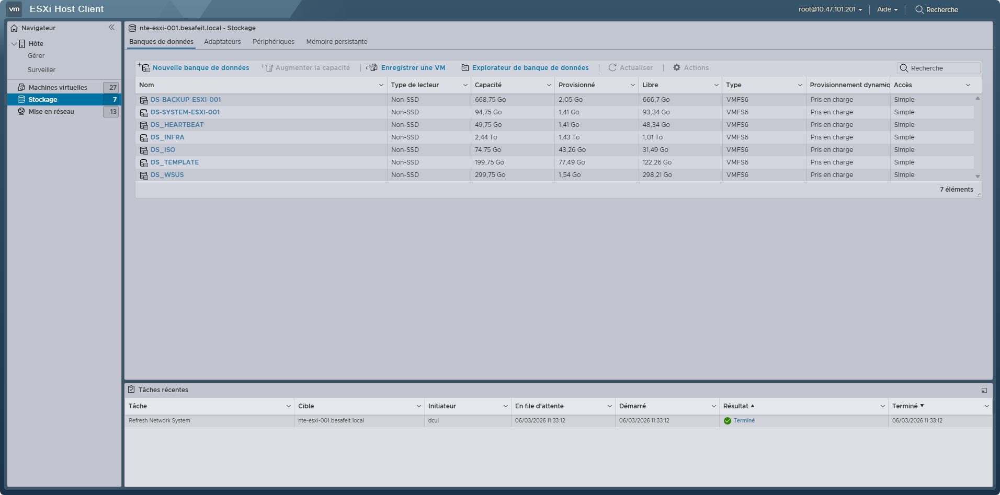

---

### 🎯 Résultat attendu

L’hôte ESXi est capable :

- d’accéder aux volumes de stockage via iSCSI
- d’utiliser plusieurs chemins réseau vers la baie
- d’assurer une meilleure résilience du stockage

Cette configuration constitue la base du stockage des machines virtuelles de l’infrastructure **BESAFE**.

---

## ✅ Résumé des étapes

| Étape | Objectif | Résultat attendu |
|:--|:--|:--|
| 1️⃣ **Configuration réseau de management** | Définir une IP statique, DNS et passerelle | Accès stable à l’interface web |
| 2️⃣ **Architecture réseau virtuelle** | vmk, vSwitch, Port group | Configuration et uniformisation de l'architecture réseau |
| 3️⃣ **Architecture stockage iSCSI** | Initiateur iSCSI, target, LUN, DATASTORE | Reliés nos hyperviseurs à la baie de stockage |

---

## 🔗 Liens utiles

- [Documentation officielle VMware ESXi](https://docs.vmware.com/fr/VMware-vSphere/index.html)
- [Guide vCenter Server](/vCenter)
- [Schéma BESAFE](/Infrastructure/Schéma)
