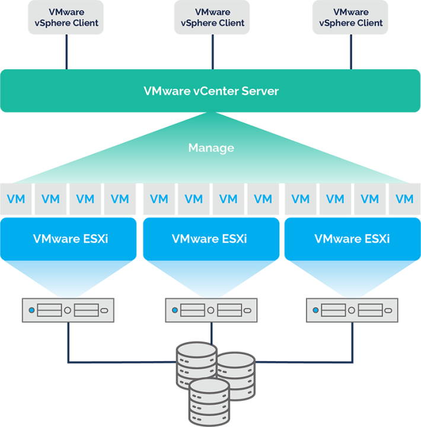
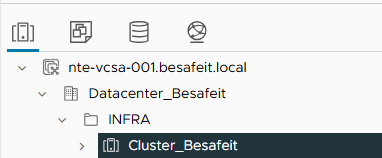
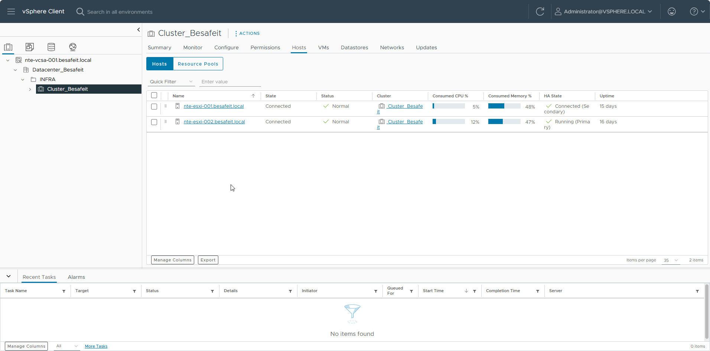
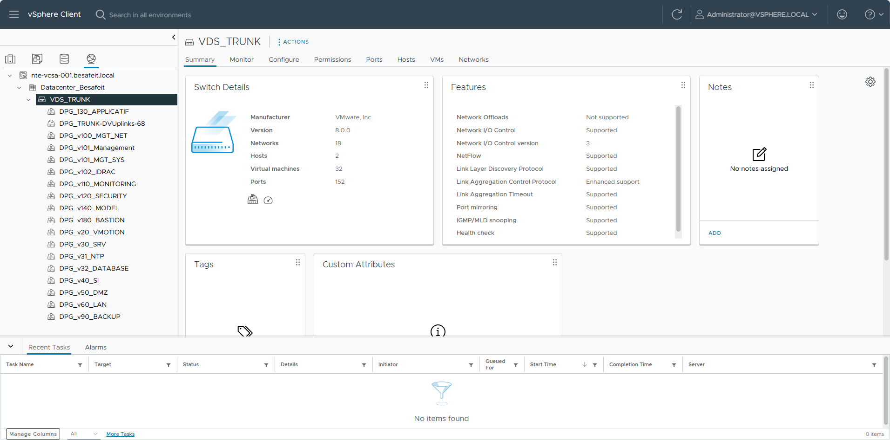
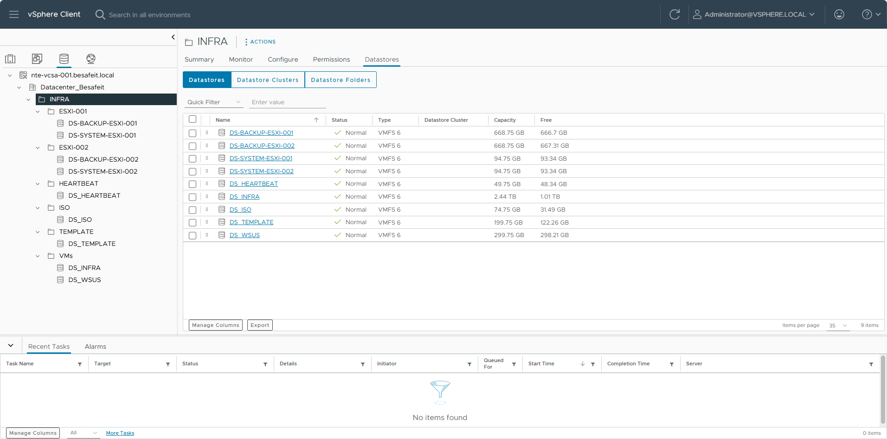
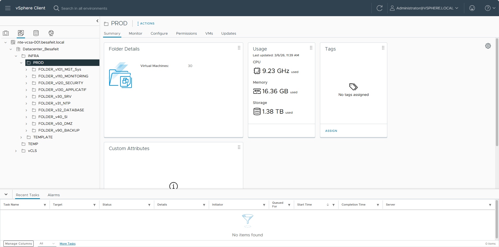

# 🖥️ Installation et configuration de VMware vCenter Server (VCSA)

> Cette page décrit l’installation et la configuration initiale de **VMware vCenter Server Appliance (VCSA)** pour la gestion centralisée des hôtes **ESXi** du projet **BESAFE**.

---

## ⚙️ Détails techniques

| Élément | Valeur |
|:--|:--|
| **Nom d’hôte** | NTE-VCSA-001 |
| **Adresse IP** | 10.47.101.204 |
| **Version** | vCenter Server Appliance 8.0.2 |
| **Hôtes gérés** | NTE-ESXI-001 (10.47.101.201) – NTE-ESXI-002 (10.47.101.202) |
| **Domaine** | BESAFEIT.LOCAL |
| **Système d’exploitation** | VMware Photon OS |
| **Rôle** | Gestion centralisée du cluster ESXi BESAFE |
| **Objectif** | Supervision, clustering, gestion des ressources et des licences |

---

## 🧩 Étape 1 : Architecture vCenter BESAFE

Le **vCenter Server Appliance (VCSA)** constitue le point central d'administration de l'infrastructure VMware.

Contrairement aux hôtes ESXi qui exécutent les machines virtuelles, le vCenter permet de :

- centraliser la gestion des hôtes
- orchestrer les clusters
- gérer les réseaux distribués
- administrer le stockage
- superviser l'ensemble de l'infrastructure

Dans l’infrastructure **BESAFE**, le vCenter permet de piloter l’ensemble des ressources de virtualisation depuis une interface unique : **vSphere Client**.
  

  
---
  
### Architecture logique

vCenter Server
│
└── Datacenter_Besafeit
│
└── INFRA
│
└── Cluster_Besafeit
├── ESXi-001
└── ESXi-002
  

  
Cette organisation permet de structurer l'infrastructure VMware selon une hiérarchie logique :

- **vCenter** : gestion globale
- **Datacenter** : conteneur logique de l'infrastructure
- **Cluster** : regroupement des hôtes
- **Hosts ESXi** : hyperviseurs exécutant les VM

---

## 🖥️ Étape 2 : Cluster VMware

  
Le cluster **Cluster_Besafeit** regroupe les deux hôtes ESXi de l’infrastructure :

- nte-esxi-001.besafeit.local
- nte-esxi-002.besafeit.local

Ce regroupement permet de mutualiser les ressources matérielles :

- CPU
- mémoire
- stockage
- réseau

### Fonctionnement d'un cluster VMware

Un cluster permet notamment d'activer plusieurs mécanismes essentiels :

**High Availability (HA)**  
Si un hôte ESXi tombe en panne, les machines virtuelles peuvent être redémarrées automatiquement sur l'autre hôte.

**vMotion**  
Les machines virtuelles peuvent être déplacées d'un hôte à un autre **sans interruption de service**.

**Répartition des ressources**  
Les ressources CPU et mémoire sont partagées entre les hôtes.

Cette architecture garantit une **continuité de service** pour les machines virtuelles.

---

## 🌐 Étape 3 : Réseau distribué (VDS)

L'infrastructure BESAFE utilise un **vSphere Distributed Switch (VDS)** nommé : **VDS_TRUNK**

Contrairement aux vSwitch standards présents sur chaque hôte ESXi, un **VDS centralise la configuration réseau au niveau du vCenter**.

### Avantages du VDS

- configuration réseau centralisée
- cohérence entre tous les hôtes
- simplification de l'administration
- meilleure visibilité du trafic réseau

### Fonctionnement

Le VDS transporte l’ensemble des **VLAN de l’infrastructure** via un trunk réseau.

Les réseaux sont ensuite exposés sous forme de **Distributed Port Groups (DPG)**.

Exemples de port groups :

Chaque port group correspond à un **VLAN spécifique de l’infrastructure**.

Les machines virtuelles se connectent à ces réseaux virtuels via leurs interfaces réseau.

---

## 💾 Étape 4 : Organisation du stockage

Le stockage de l'infrastructure VMware est organisé via plusieurs **datastores VMFS**.

Ces datastores sont partagés entre les hôtes ESXi afin de permettre :

- la migration vMotion
- la haute disponibilité
- la répartition des machines virtuelles

Un DATASTORE = une fonction
L'objectif était de rendre les LUN et les DATASTORE clair à l'utilisation.
  
| Nom | Fonction |   
|:--|:--|
| DS_INFRA | Les VMs de toute l'infrastructure BESAFE |
| DS_ISO | Toutes les images systèmes dont l'infrastructure à besoin |
| DS_TEMPLATE | Nos templates de VM |
| DS_HEARTBEAT | HA et DRS vCenter |
| DS_BACKUP | Nos sauvegardes, en local sur le serveur et sur le NAS |
| DS_SYSTEM | La partition système du serveur |

---

## 📁 Étape 5 : Organisation des machines virtuelles

Les machines virtuelles sont organisées dans des **dossiers logiques** afin de structurer l’infrastructure.

Cette organisation facilite :

- la lisibilité
- l'administration
- la gestion des permissions

### Structure des dossiers
  

Chaque dossier correspond à un **réseau ou un rôle spécifique dans l’infrastructure**.

Exemples :

- **MONITORING** : supervision
- **SECURITY** : outils de sécurité
- **DMZ** : services exposés
- **BACKUP** : infrastructure de sauvegarde

Cette organisation permet de maintenir une **infrastructure claire et structurée**.

---

## ✅ Résumé global

| Étape | Objectif | Résultat attendu |
|:--|:--|:--|
| **1️⃣ Architecture vCenter BESAFE** | Centraliser l’administration de l’infrastructure VMware | Gestion unifiée via vSphere Client |
| **2️⃣ Cluster VMware** | Regrouper les hôtes ESXi pour mutualiser les ressources | Haute disponibilité et orchestration |
| **3️⃣ Réseau distribué (VDS)** | Centraliser la gestion réseau des hôtes ESXi | VLANs et port groups uniformisés |
| **4️⃣ Organisation du stockage** | Structurer les datastores VMware | Stockage partagé pour les VM |
| **5️⃣ Organisation des machines virtuelles** | Classer les VM par rôle et par VLAN | Infrastructure claire et maintenable |

---

## 🔗 Liens utiles

- [Documentation VMware vCenter Server](https://docs.vmware.com/fr/VMware-vSphere/index.html)
- [Guide d’installation ESXi](/Esxi)
- [Schéma BESAFE](/Infrastructure/Schéma)

